# Animations

The main difference between :active and :focus is that "focus" is a persistent state, while :active just a moment.

## What's the *transform* doing in CSS3?


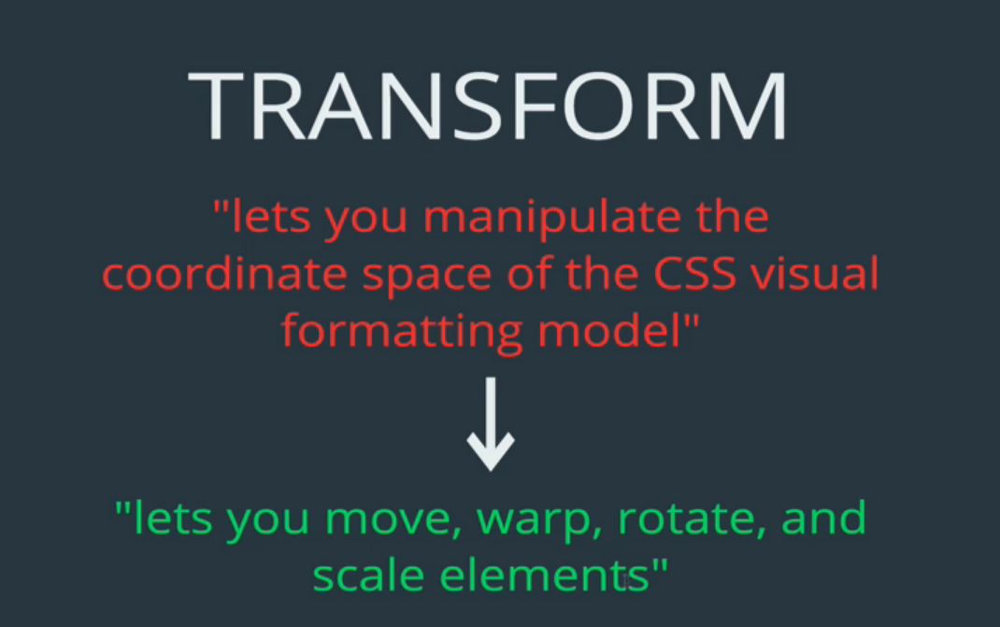


Three main transform function:

- **Translate** 

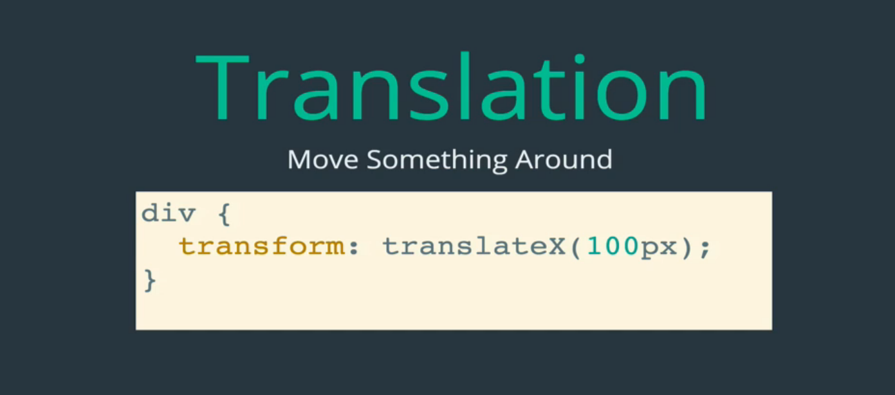

*translate* can take two parameters, one for **x**, one for **y**.

- **rotate**

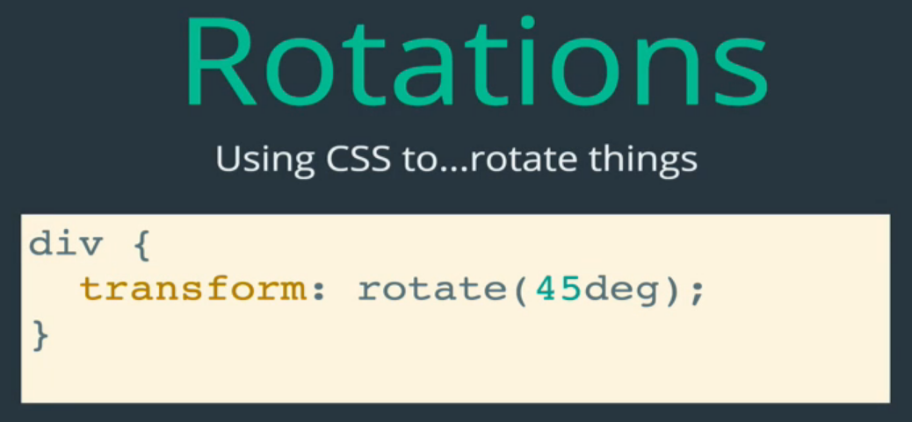


- **scale**

It's quite self-explanatory. However, you can set the 坐标原点 (origin) by an attribute - *transform-origin* **x** **y** 

The default origin is the 几何中心. Also, you can set the origin by the *directions*, such as bottom, top and left etc. For more details, please check the official document on MDN.


> Note that *vendor prefixes*  promises the function of the rotate/transform
>
> Use auto-prefixes!! Just google it!!


**Note that** if you wanna combine several transformations together, write them all in the same line; otherwise, the latter one will overwrite the upper one. For instance, 

> `transform: scale(2) rotate(45deg)`


## Transition 

This allows us to control the speed of transformation. There are four properties for transaction:

1. *transition-duration*
2. *transition-property*
3. *transition-timing-function*
4. *transition-delay*

By default, every change is transition. In some cases, we don't want to all changes sharing the same transition-duration. Here comes the *transition-property* : you can assign or point out which property to do the transition. (1, 2 can be combined together one by one):


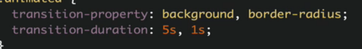

shorthand transitions 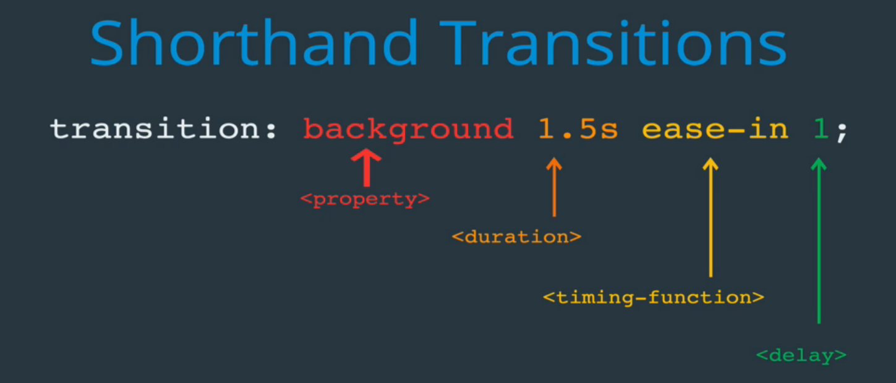


what should be transitioned? 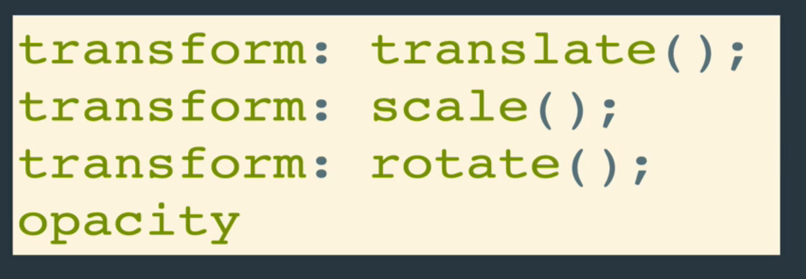

Since there are so many properties supporting transition. But in terms of efficiency, only above four properties should be transitioned. There is a great article for extended material.

[Discuss the reasons why these four properties deserve to be transitrioned from  the mechanism of browser](https://www.html5rocks.com/en/tutorials/speed/high-performance-animations/)


> You can use *filter* property to set filters to the image!!


## Keyframes

Steps:

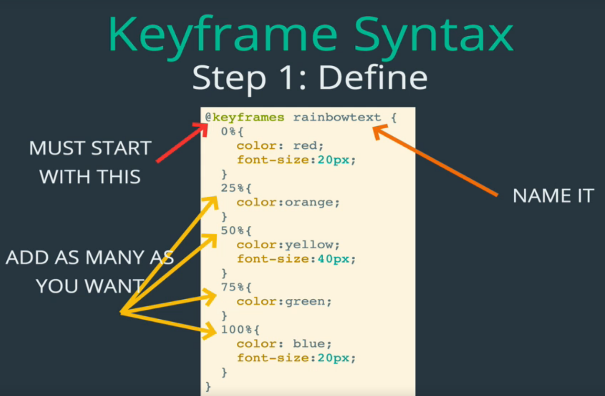

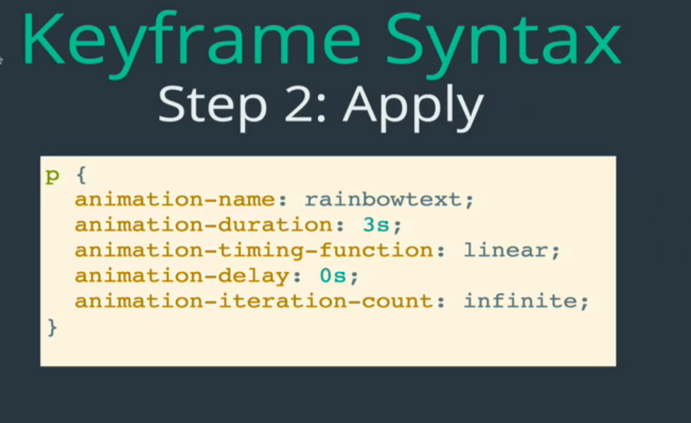

 Besides the properties above, there are some new properties that deserves highlighting:

- animation-direction

- animation-iteration-count

- animation-fill-mode (Only *forwards* will be used frequently; the function of *forwards* is turn the animation into the original state.)

- animation-play-state (Pause or Running)

## Shortcut for Animation

The first time must be duration, while the second is delay.

The animation name can be placed as you want.

Exploring CodePen where you can find several demos for loading.

 

# Layouts in CSS - Flexbox, Grid Layout


Flexbox and grid layout are really **responsive**!

Whenever you need to review the layout knowledge, you can go into these two websites:

[A complete guide to Flexbox](https://css-tricks.com/snippets/css/a-guide-to-flexbox/)

[A complete guide to grid layout](https://css-tricks.com/snippets/css/complete-guide-grid/)

Or you can search 阮一峰


其实你可以在简书上面学习写一些技术性翻译，这样就可以得到点赞了！把自己也混淆的概念给翻译出来；自己也加深了印象，又练习了英语：

There are some topics you can translate in the future:

- [ ]  property vs attributes
- [ ]  Closure
- [ ]  CSS layouts

OK, let's go back to the "flex box"; there are some terminologies you need to be familiar beforehand:

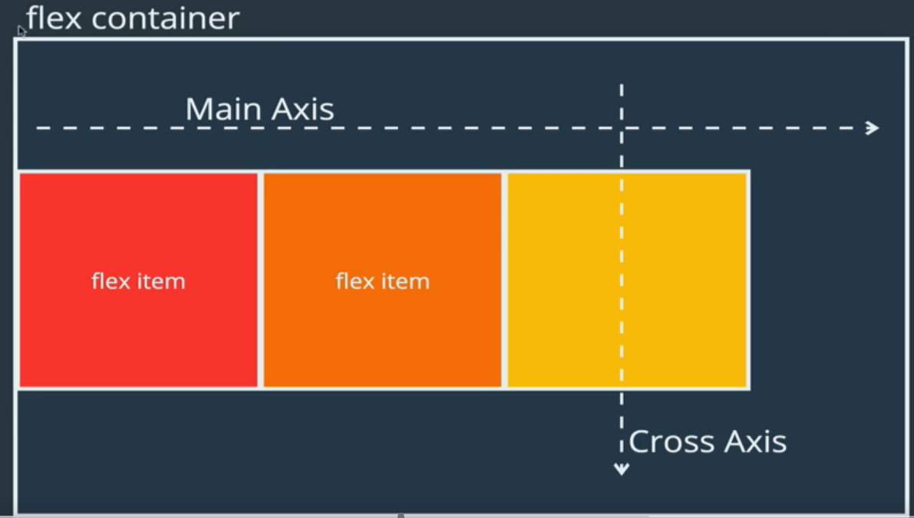

>  Note that you can change the directions of the axis.

- **flex-direction** defines the main axis and its direction. (specifies how the items should be placed in the container)

  you can choose *row/ row-reverse / column/ column-reverse*  

- **flex-wrap** specifies whether items are forced into one line or can be placed between multiple lines; specifies how  will wrap behave if you need to change a row/ column

  Alternatives: *wrap (multiple lines)* / *wrap-reverse*

- **justify**-**context** defines how space is distributed between items in the flex container<span style= "color:blue"> *along the main axis* </span>. 

  Alternatives: *space-between/ space-around/ flex-end*.

- **align-items** defines how space is distributed between items in the flex container <span style="color:blue">*along the cross axis*</span>.

  Alternatives:*flex-start/ stretch/ flex-end/ center*

    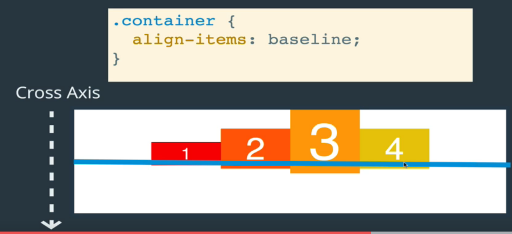

  - **align-content** defines how space is distributed <span style="color: orange"> between rows</span> in flex container <span style="color:blue">*along the cross axis*</span>; this will be used in the scenarios where you wrap items into multiple rows. 


## Tutorial - How to make a responsive navbar?

Our goal is make a navbar that can switch the model corresponding to the window size changes.

Here you need @**media** key word. media queries

```css
@media screen and (max-width: 920px) {

	styles go here

}
```


## How flex items align themselves?


*align-self* : align itself individually out of the *align-item* property defined by the container (along the cross axis)

*order* : change the item order; all items default by 0; thus, you might need to set orders for other items


*flex*: defines how a flex item will grow or shrink to fit the available space in a container (shorthand property for 3 other properties)

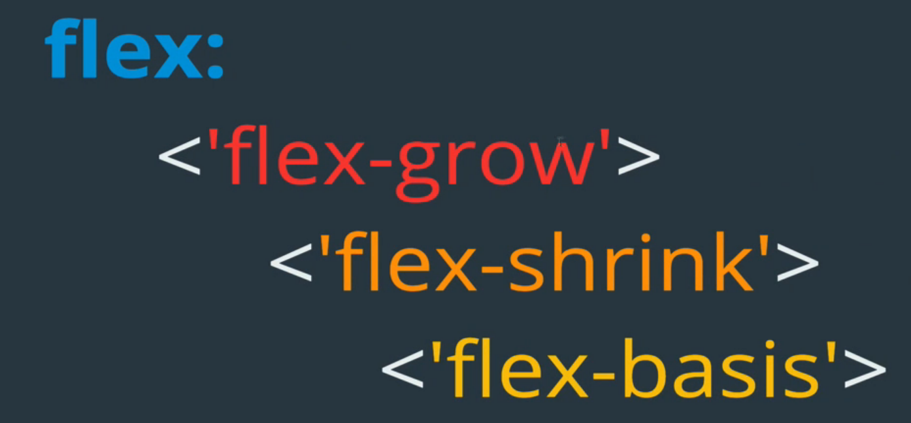

- *flex-grow* : dictates how **the unused space** should be spread amongst flex items (给其中一个item两倍于另外的items; 如果不设置这个property，items will not share the free space!) 注意，这个分的是idle space，而不是真正的比例！
- *flex-shrink* : dictates how items should shrink when there isn't enough space in container. 缩小的比例！One of most common uses is shrinking items with different ratios. (For instance, the middle one will shrink as slower twice as the two edges ones. 中间缩小的慢, 两边缩小的快) 
- *flex-basis* : specifies the ideal size of a flex item before it's placed into a flex container (initial width) [Difference between flex-basis and width](http://gedd.ski/post/the-difference-between-width-and-flex-basis/)


These three properties are really useful and important, by which you can make a navbar or banner that can modify its length with the change from the size of the window.

Here is the code and the code pen demo:


```css
.container {
  display: flex;
  flex-wrap: wrap;
}

.box {
  background: #cc0042;
  flex: 1 1 200px;
  color: white;
  font-family: Helvetica;
  padding: 20px;
  transition: 0.1s background;
}

.middle {
  background: #b20039;
}

.box:hover {
  background: #ff0052;
}

h3 {
  font-size: 30px;
}
```


# Async basics in JavaScript

## Callback Functions


a function that is passed into another function as parameter then invoked by that other function

There are some very useful advanced methods built in the array; here I just list them out, you can find the corresponding explanation in MDN.

- *forEach*
- findIndex


## The Stack and Heap

#### What is the Stack?

- An ordered data structure

- Keeps track of function invocations

- part of the JavaScript runtime (you don't access it directly)


#### How you code changes the stack?

- Whenever you *invoke a function*, the details of the **invocation are saved to the top of the stack (pushed to the top)**
- Whenever a function returns, the information about the invocation popped off of the top.


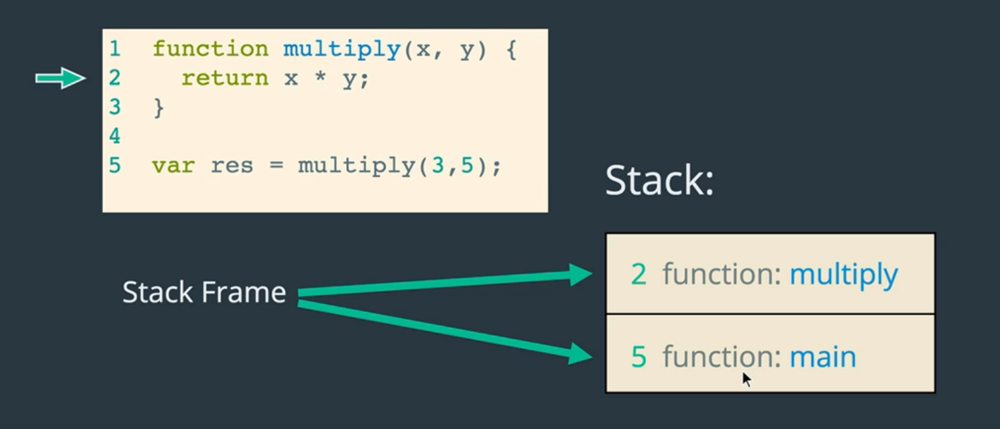  


#### What is Heap?

An area in memory where your data is stored

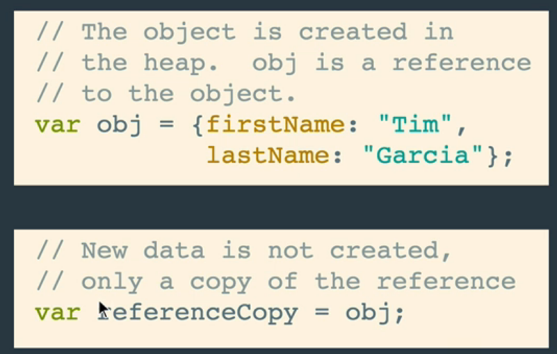


#### setTimeout and setInterval

Both of these can asynchronously invokes a callback after a delay in milliseconds;

setTimeout only calls once, while setInterval will call the callback every x milliseconds.

You can cancel these two methods by *clearTimeout/ clearInterval*


## The Event Loop and the Queue


#### What is the Queue?

An ordered list of functions waiting to be placed on the stack (FIFO)


#### What is the Event Loop?

Functionality in the JavaScript runtime that checks the queue when the stack is empty.


> [There is a really great video demonstrating how it works in javascript.](https://vimeo.com/96425312)
>
> This is great!! You should review it whenever you forget the details of the event Loop


If the **stack is empty**, the front of the queue is placed in the stack


> Note that ``` setTimeout(anonymousFunc, 0);``` does not mean running immediately but the system will execute it once the stack is empty. 


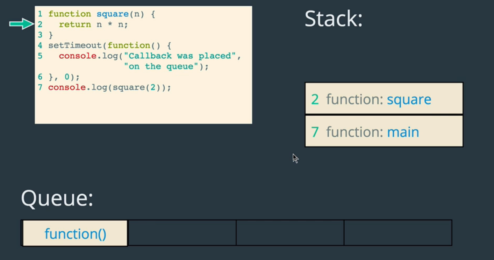

So, the console log will be "4" -> "Callback blablabla"

**JS single threaded**: code execution is linear. Code that is running cannot be interrupted by something else going on in the program. 

> Q: *Since its single-threaded language, how could it be possible to do the things asynchronously?* 
>
> A: There is another stuff you ignored called *web apis*. Web apis can be independent from JavaScript. Whenever you call setTimeout or fetch data, it will not be pushed into the stack immediately or put into the task queue. **They can live outside of JS by chrome/browser asynchronously.** Once they finish,  they will be pushed into the task queue sequentially.  Finally, once the stack is empty, items in task queue will be popped off and pushed into the top of the stack.


#### What is Promise?

an Object that represents a task that will be completed in the future


## AJAX

There is great article for extension reading:

[What is Ajax? And why we need it.](http://adaptivepath.org/ideas/ajax-new-approach-web-applications/)

1. XMLHttpRequest
2. fetch API
3. jQuery
4. Axios

APIs don't respond with HTML, but pure data!


*XHR.onreadystatechange* takes a callback function which will be called whenever the state has changed.

Use XHR.status to get the http response code.

> Note that do not forget to use *JSON.parse()* to parse your data fetched from the server

new XMLHttpRequest() must be put into the click listener! Because you need to invocate AJAX request every time you click the button!

 

- fetch API

fetch supports Promises!

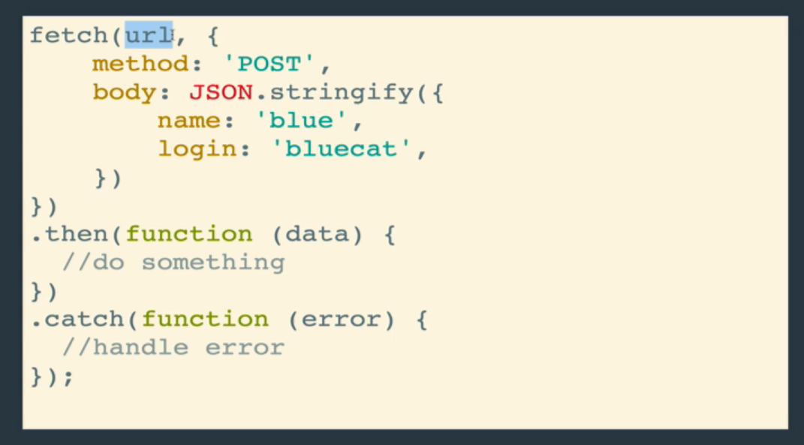


You can specify things manually in option object.


#### How do we handle 404 issues when using *fetch* API?

Even though you made a 404 response, however, you still cannot catch that error! Since you made the request successfully, you will get catchable error if there exists any connection issue.

Thus, the correct way to handle 404 is :

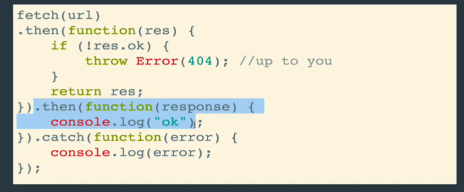

There is a great paradigm to handle error, here is the code:

```javascript
var btn = document.querySelector("button");
btn.addEventListener("click", function(){
  var url = 'https://api.github.com/users/coltasdas';
  fetch(url)
  .then(handleErrors) // This is always good to build an error handling layer
  .then(function(request){
    console.log("EVERYTHING IS FINE!");
    console.log(request);
  })
  .catch(function(error){
    console.log(error);
  });
});

function handleErrors (request){
  if(!request.ok) {
    throw Error(request.status);
  }
  return request;
}
```

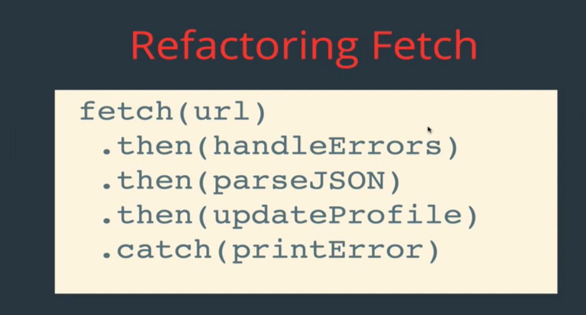

As you can see, the recommendation paradigm is a great example to illustrate how to make you code clear and meaningful. Every layer has its own function.


#### Axios

Automatically transform to json!!

```javascript
axios.get(url)
.then(function(res){
    console.log(res.data);
})
.catch( function(e){
    console.log(e);
})
```

You don't need jQuery if you just wanna use AJAX.

For Axios, there is a params object, you c an append and set RESTful API parameters in the object. 

There is built-in error-handling mechanism in axios err.response and err.request 


# Closure and this keyword

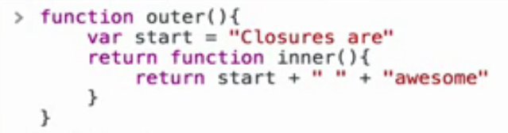

closure don't remember everything from an outer function - just the variables they need!

Closures mean that inner function makes use of the variable from outer function while the outer function has returned.

The most commonly use case of closure is to create private / immutable variable.

> Note that if you wanna maintain an array in a function, do not forget to manipulate the array while return the **array.slice()**. (Copy)  Here is the case: 
>
> 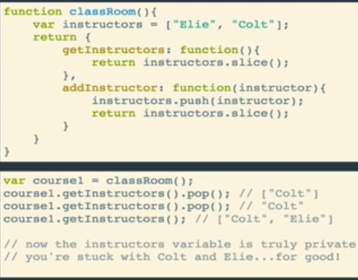


this  = execution context (an object)

**whenever a function is run***, the key words *this* and *arguments* will be assigned. 


> 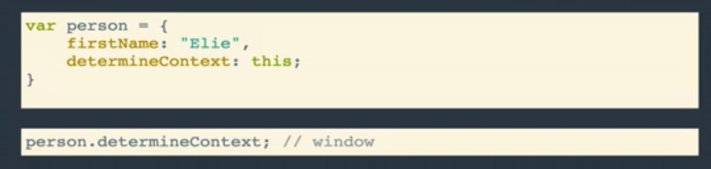
>
> The tricky here is that a keyword *this* is defined when a function is run! There is not a function being run here to create a new value of the keyword *this* so the value of *this* is still the *window*!


When 'this' is *not inside* of a **declared object**, 'this' refers to the 'window' object.

So, inside a function this will not change.

*this* always refers to the closest parent object.


#### Explicit Binding

- apply
- bind
- call

> Note that there three methods can only be invoked on functions. They can only be used by functions


| name of  methods | parameters              | invoked immediately? |
| :--------------- | ----------------------- | -------------------- |
| call             | thisArg, a, b, c,d, ... | Yes                  |
| apply            | thisArg, [a,b,c,....]   | Yes                  |
| bind             | thisArg, a,b,c,d,...    | No                   |


##### When do we use 'call'?

> invoked immediately means the function sets the *call* method will be invoked without delay, like theFunction():
>
> 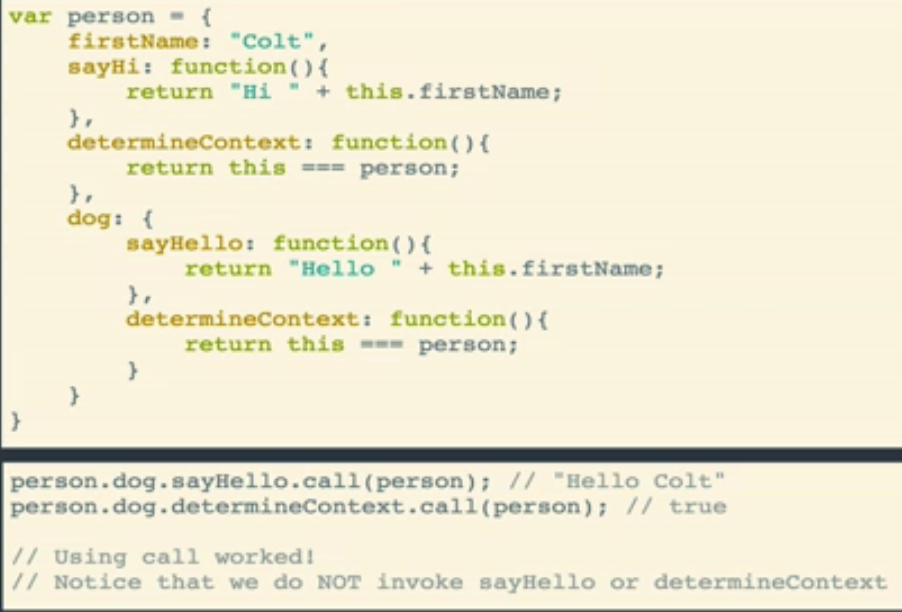


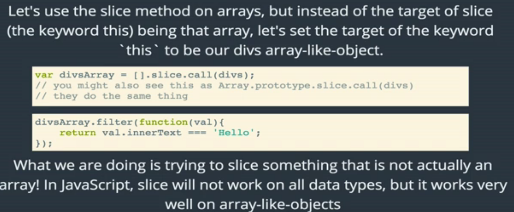

Here, divs = getElementsByTagName('div'); it's not an array, but an array-like object.

##### When do we use 'apply'?

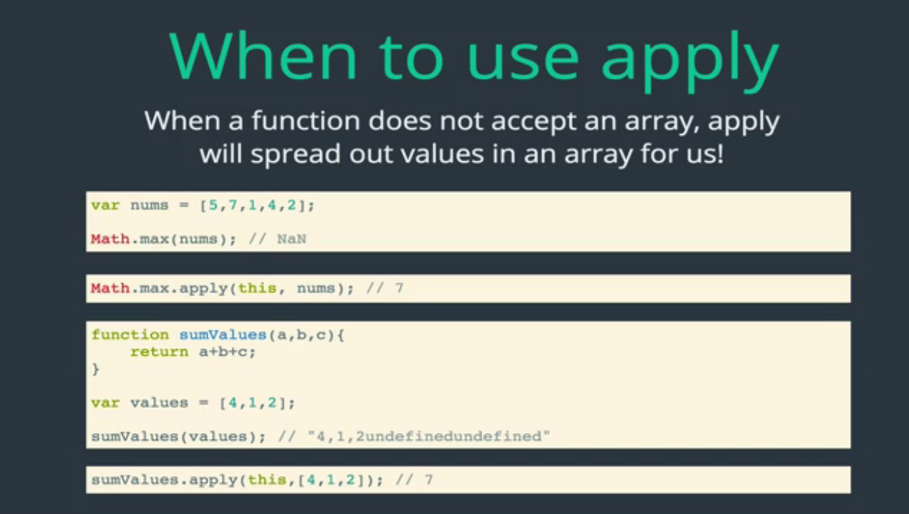

*apply* will help us spread out values if the function only takes individual parameters as parameters.

##### When  do we use 'bind'?

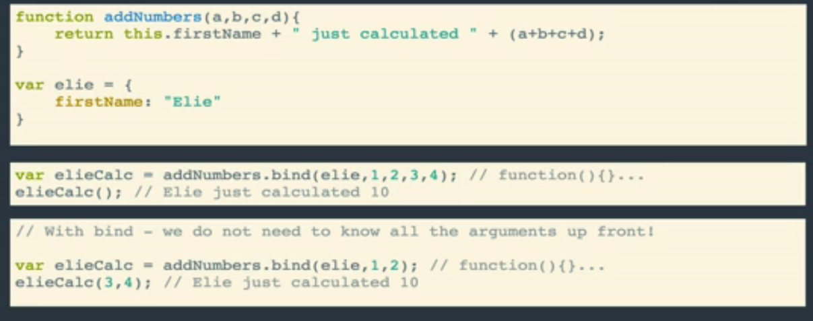

As we demonstrated before, the most different part for *bind* is it will return a *currying* function! You can pass the parameters later! 

> There is a very tricky example:
>
> 


#### Why do we use 'strict' mode?

- prevent us create a global variable unconsciously.

​             

# Object Oriented Programming

##  The function of 'new' key word

- It first creates an empty object
- It then sets the keyword 'this' to be that empty object
- It adds the line `return this` to the end of the function, which follows it
- It adds a property onto the empty object called `__proto__` , which links the prototype property on the constructor function to the empty object

 To avoid duplication : 

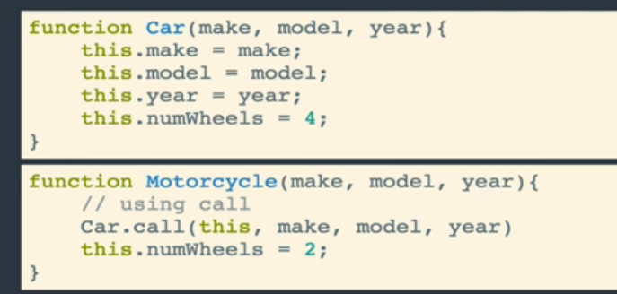

You can borrow the constructor from another constructor by using call/apply

Diagram to illustrate the relationship between these  relationship: (circle is function; and squares are objects):

  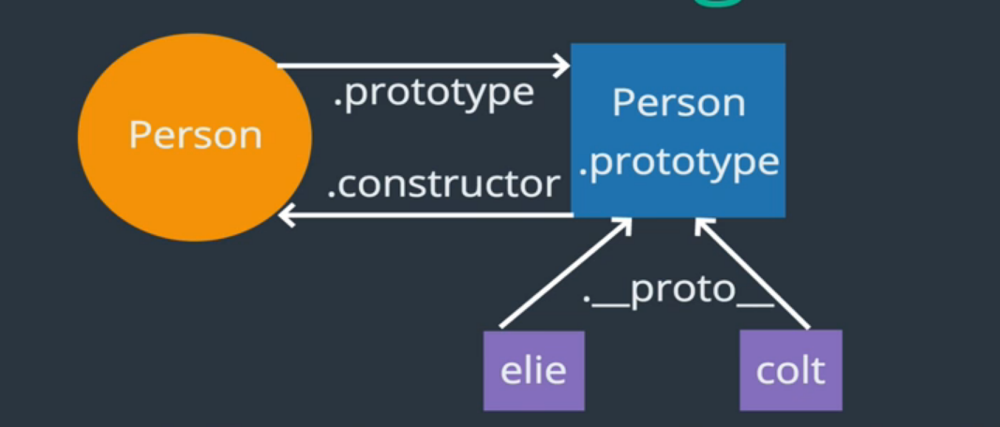

- Every constructor function has a property on it called  "prototype", which is an object
- The prototype object has a property on it called "constructor", which points back to the constructor function
- Anytime an object is created using the 'new' keyword, a property called "\_\_proto_\_" gets created, linking the object and the prototype property of the constructor function. 

##  The prototype chain


<center>     
    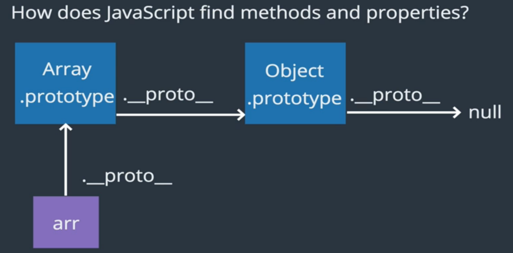     
    <br>     
    <div style="color:orange; border-bottom: 1px solid #d9d9d9;     					display: inline-block;     
                color: #999;     
                padding: 2px;">
        How does JavaScript search for properties and methods
    </div> 
</center>

It will look for the property or methods along the `__proto__` and repeat until there is not `__proto__`

So, why do we need it? Let me show you a example:

```javascript
function Person(name) {
    this.name = name;
    this.sayHi = function (){
        return "Hi " + this.name;
    }
}
```

This constructor function is inefficient. Every time we make an object using the `new` keyword we have to redefine the `sayHi` function!

To handle this issue, we can add this method into the `prototype` instead.

```javascript
Person.prototype.sayHi = function() {
    return 'Hi '+ this.name;			 
}
```


## Inheritance

> Please differentiate inheritance and prototype chain during the interview! They are totally two different things!


As I mentioned in the last section, we define the `Person` constructor function; we can borrow the constructor function from `Person` when building new `Student` constructor function.

However, we have defined the `sayHi` method on `Person`'s `prototype`. `Student` doesn't get this method from `Person` 

(recall what `apply` does when `new` keyword was being used and the 4 steps in object creation process)

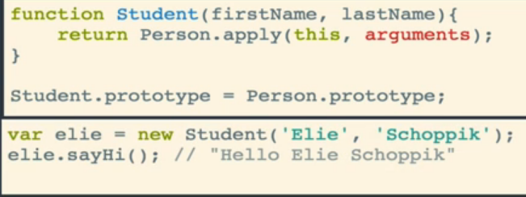

If you did this way, `Person` would be influenced; since then, all new instances of Person will be impacted. Because object is passed by reference! 

The solution is to create an copy `prototype` to the prototype of `Student`


>Why not '`new`'?
>
>```javascript
>function Student(firstName, lastName) {
>    return Person.apply(this, arguments);
>}
>
>Student.prototype = new Person;
>```
>
>This will do almost the same thing, but add additional unnecessary properties on the prototype object (since it is creating an object with undefined properties just for the prototype)


Finally, don't forget to reset the constructor pointer!

`Student.prototype.constructor = Student` (You have set the prototype as `Person's prototype`)

### `exports`  usage

When writing the Node.js code; they is a pretty concise way to write routes

```javascript
/*use express.js*/
router.route('/')
	.get(helpers.getTodos)
	.post(helpers.createTodos)

router.route('/:todoId')
	.get(helpers.getToDo)
	.put(helpers.updataTodo)
	.delete(helpers.deleteTodo)

/* This is another file and folder that segregates all routes and refactors your code*/

//handling logic in callback
exports.getTodos = callback 
```


If you wanna use a `static file in Nodejs`; add following path to express:

```javascript
var express = require('express'),
	app = express();
	
app.use（express.static(__dirname + '/views'）
```


> **Note that there is a pretty common issue we need to handle is all listeners are applying even to dynamically generated code**


# ES6

## Main Additions

There are great e-book about ES2015

[Understanding ECMAScript 6](https://github.com/nzakas/understandinges6)

### let, const

You cannot declare a `const` variable without initialization; `const` a object whose properties can be changed. `let` variables' values can changed and reassigned. No hoisting effect (*<u>It does hoist, but it is in a TDZ so we can not access it</u>*) as `var` does. 

### template strings (literals)

> You can set `tag` function to handle this literals, which just likes what `haskell` does. For  more details, please read the e-books I mentioned above.

### Arrow Functions

you can omit `return`

```javascript
var add = (a,b) => {
    return a+b;
}

var add = (a,b) => a+b;
```

1. Arrow functions do not get their own `this` keyword

2. Inside of an arrow function, the keyword `this` has its original meaning from <u>the enclosing context</u>. 

   > *Recall: As mentioned before, when normal functions run, their `this` and `arguments` parameters will be set. But this is not the case for arrow function.*

3. The fact that arrow functions do not have their own `this` keyword can be quite helpful - you just need to understand when you might NOT want that!

Here let's review the concept of closure combined with arrow functions to see how `this` weird feature can help us.

```javascript
var instructor = {
    firstName: "Yipin",
    sayHi: function(){
        setTimeout(function(){
            console.log("Hello " + this.firstName);
        }, 1000);
    }
}

instructor.sayHi(); // "Hello undefined"

/* ↓↓↓ To handle this, we use closure ↓↓↓ */

var instructor = {
    firstName: "Yipin",
    sayHi: function(){
        setTimeout(function(){
            console.log("Hello " + this.firstName);
        }.bind(this), 1000);
    }
}

instructor.sayHi(); // "Hello Yipin"

/* Refactor code more concise by the feature of arrow function */
var instructor = {
    firstName: "Yipin",
    sayHi: function(){
        setTimeout(() => {
            console.log("Hello " + this.firstName);
        }, 1000);
    }
}

instructor.sayHi(); // "Hello Yipin"

/* 
	Arrow functions do not have their own keyword this.  The keyword this 		refers to its enclosing context (the instructor object).
	
	Note that we cannot use arrow function in sayHi property.
	In the code below, `this` keyword refers to the global context 
	(window object)
*/

var instructor = {
    firstName: "Yipin",
    // can't use an arrow function here
    sayHi: () => {
        setTimeout(() => {
            console.log("Hello " + this.firstName);
        }, 1000);
    }
}

instructor.sayHi(); // "Hello undefine"

/*
	Actually, arrow functions should never be used as methods in objects
*/

```

```javascript
let createStudentObj = 
    (firstName, lastName) => ({firstName:firstName, lastName:lastName});

//return a object and how it can be used
```


What is spread?

```javascript
var arr = [3,2,4,1,5];
Math.max(arr); //NaN
Math.max.apply(this, arr); //5
Math.max(...arr); //5
```


### default parameters

when nothing is passed into the function, we can use default parameters

```javascript
function add(a=2,b=2){
    return a+b
}
```

### rest and spread operators

```javascript
function printRest(a,b,...c){
    console.log(a);
    console.log(b);
    console.log(c); //no ... here!!
}

printRest(1,2,3,4,5); 

// 1
// 2
// [3,4,5]

//Here is a comparision:
// ES5
function sumArguments(){
    var total = 0;
    for(var i = 0; i < arguments.length; i++){
        total += arguments[i];
    }
    return total;
}

// A little fancier ES5; note that `arugments` is not an array.
function sumArguments(){
    var argumentsArray = [].slice.call(arguments);
    return argumentsArray.reduce(function(accumulator,nextValue){
        return accumulator + nextValue;
    });
}

/* ES2015; arrow functions dont have this and arguments while you can use rest operator.*/

var sumArguments = (...args) => args.reduce((acc, next) => acc + next);
```


### for...of loops

```javascript
var arr = [1,2,3];
for(let val of arr){
    console.log(val);
}
```

However, we cannot use a for loop to iterate over an object. (because arr.\__proto__ has a property called Symbol.iterator which does not exist in object)


> To summarize,  `of` can only be used on data structures with a Symbol.iterator method implemented!


- object shorthand notation
- computed property names
- object destructuring
- array destructuring
- class keyword
- super and extends keywords
- Maps / Sets
- Promises
- Generators
- Object, Number, Array methods


