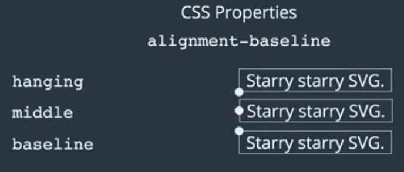

# Animations

The main difference between :active and :focus is that "focus" is a persistent state, while :active just a moment.

## What's the *transform* doing in CSS3?

```flow
st=>start: lets you manipulate the coordinate space of the CSS visual formatting model
op=>operation: TRANSFORM
e=>end: lets you move, warp, rotate, and scale elements
op->st->e

```


Three main transform function:

- **Translate** 

```css
div {
    transform: translateX(100px);
}
```

*translate* can take two parameters, one for **x**, one for **y**.

- **rotate**

```css
div {
    transform: rotate(45 deg);
}
```


- **scale**

It's quite self-explanatory. However, you can set the origin by an attribute - *transform-origin* **x** **y** 

The default origin is the "center". Also, you can set the origin by the *directions*, such as bottom, top and left etc. For more details, please check the official document on MDN.


> Note that *vendor prefixes*  promises the function of the rotate/transform
>
> Use auto-prefixes!! Just google it!!


**Note that** if you wanna combine several transformations together, write them all in the same line; otherwise, the latter one will overwrite the upper one. For instance, 

> `transform: scale(2) rotate(45deg)`


## Transition 

This allows us to control the speed of transformation. There are four properties for transaction:

1. *transition-duration*
2. *transition-property*
3. *transition-timing-function*
4. *transition-delay*

By default, every change is transition. In some cases, we don't want to all changes sharing the same transition-duration. Here comes the *transition-property* : you can assign or point out which property to do the transition. (1, 2 can be combined together one by one):

```css
div {
    transition-property: background, border-radius;
 	transition-duration: 5s, 1s;
}
```

​	 


### What should be transitioned? 

1. transform: translate();
2. transform: scale();
3. transform: rotate();
4. opacity


Since there are so many properties supporting transition. But in terms of efficiency, only above four properties should be transitioned. There is a great article for extended material.

[Discuss the reasons why these four properties deserve to be transitrioned from  the mechanism of browser](https://www.html5rocks.com/en/tutorials/speed/high-performance-animations/)


> You can use *filter* property to set filters to the image!!


## Keyframes

Steps:


 Besides the properties above, there are some new properties that deserves highlighting:

- animation-direction

- animation-iteration-count

- animation-fill-mode (Only *forwards* will be used frequently; the function of *forwards* is turn the animation into the original state.)

- animation-play-state (Pause or Running)

## Shortcut for Animation

The first time must be duration, while the second is delay.

The animation name can be placed as you want.

Exploring CodePen where you can find several demos for loading.

# Layouts in CSS - Flexbox, Grid Layout


Flexbox and grid layout are really **responsive**!

Whenever you need to review the layout knowledge, you can go into these two websites:

[A complete guide to Flexbox](https://css-tricks.com/snippets/css/a-guide-to-flexbox/)

[A complete guide to grid layout](https://css-tricks.com/snippets/css/complete-guide-grid/)


OK, let's go back to the "flex box"; there are some terminologies you need to be familiar beforehand:


>  Note that you can change the directions of the axis.

- **flex-direction** defines the main axis and its direction. (specifies how the items should be placed in the container)

  you can choose *row/ row-reverse / column/ column-reverse*  

- **flex-wrap** specifies whether items are forced into one line or can be placed between multiple lines; specifies how  will wrap behave if you need to change a row/ column

  Alternatives: *wrap (multiple lines)* / *wrap-reverse*

- **justify**-**context** defines how space is distributed between items in the flex container<span style= "color:blue"> *along the main axis* </span>. 

  Alternatives: *space-between/ space-around/ flex-end*.

- **align-items** defines how space is distributed between items in the flex container <span style="color:blue">*along the cross axis*</span>.

  Alternatives:*flex-start/ stretch/ flex-end/ center*

    

  - **align-content** defines how space is distributed <span style="color: orange"> between rows</span> in flex container <span style="color:blue">*along the cross axis*</span>; this will be used in the scenarios where you wrap items into multiple rows. 


## Tutorial - How to make a responsive navbar?

Our goal is make a navbar that can switch the model corresponding to the window size changes.

Here you need @**media** key word. media queries

```css
@media screen and (max-width: 920px) {

	styles go here

}
```


## How flex items align themselves?


*align-self* : align itself individually out of the *align-item* property defined by the container (along the cross axis)

*order* : change the item order; all items default by 0; thus, you might need to set orders for other items


*flex*: defines how a flex item will grow or shrink to fit the available space in a container (shorthand property for 3 other properties)


- *flex-grow* : dictates how **the unused space** should be spread amongst flex items (if you don't set this property，items will not share the free space.) 

  >  Note that here is setting the idle space rather than the real ratio!

- *flex-shrink* : dictates how items should shrink when there isn't enough space in container. One of most common uses is shrinking items with different ratios. (For instance, the middle one will shrink as slower twice as the two edges ones.) 

- *flex-basis* : specifies the ideal size of a flex item before it's placed into a flex container (initial width) [Difference between flex-basis and width](http://gedd.ski/post/the-difference-between-width-and-flex-basis/)


These three properties are really useful and important, by which you can make a navbar or banner that can modify its length with the change from the size of the window.

Here is the code and the code pen demo:


```css
.container {
  display: flex;
  flex-wrap: wrap;
}

.box {
  background: #cc0042;
  flex: 1 1 200px;
  color: white;
  font-family: Helvetica;
  padding: 20px;
  transition: 0.1s background;
}

.middle {
  background: #b20039;
}

.box:hover {
  background: #ff0052;
}

h3 {
  font-size: 30px;
}
```


# Async basics in JavaScript

## Callback Functions


a function that is passed into another function as parameter then invoked by that other function

There are some very useful advanced methods built in the array; here I just list them out, you can find the corresponding explanation in MDN.

- *forEach*
- findIndex


## The Stack and Heap

#### What is the Stack?

- An ordered data structure

- Keeps track of function invocations

- part of the JavaScript runtime (you don't access it directly)


#### How you code changes the stack?

- Whenever you *invoke a function*, the details of the **invocation are saved to the top of the stack (pushed to the top)**
- Whenever a function returns, the information about the invocation popped off of the top.


  


#### What is Heap?

An area in memory where your data is stored


```javascript
/* The object is created in the heap. obj is a refence to the object*/

var obj = {firstName: "Tim",
         	lastName: "Garcia"};

// New data is not created, only a copy of the reference
var referenceCopy = obj;

```


#### setTimeout and setInterval

Both of these can asynchronously invokes a callback after a delay in milliseconds;

setTimeout only calls once, while setInterval will call the callback every x milliseconds.

You can cancel these two methods by *clearTimeout/ clearInterval*


## The Event Loop and the Queue


#### What is the Queue?

An ordered list of functions waiting to be placed on the stack (FIFO)


#### What is the Event Loop?

Functionality in the JavaScript runtime that checks the queue when the stack is empty.


> [There is a really great video demonstrating how it works in javascript.](https://vimeo.com/96425312)
>
> This is great!! You should review it whenever you forget the details of the event Loop


If the **stack is empty**, the front of the queue is placed in the stack


> Note that ``` setTimeout(anonymousFunc, 0);``` does not mean running immediately but the system will execute it once the stack is empty. 


So, the console log will be "4" -> "Callback blablabla"

**JS single threaded**: code execution is linear. Code that is running cannot be interrupted by something else going on in the program. 

> Q: *Since its single-threaded language, how could it be possible to do the things asynchronously?* 
>
> A: There is another stuff you ignored called *web apis*. Web apis can be independent from JavaScript. Whenever you call setTimeout or fetch data, it will not be pushed into the stack immediately or put into the task queue. **They can live outside of JS by chrome/browser asynchronously.** Once they finish,  they will be pushed into the task queue sequentially.  Finally, once the stack is empty, items in task queue will be popped off and pushed into the top of the stack.


#### What is Promise?

an Object that represents a task that will be completed in the future


## AJAX

There is great article for extension reading:

[What is Ajax? And why we need it.](http://adaptivepath.org/ideas/ajax-new-approach-web-applications/)

1. XMLHttpRequest
2. fetch API
3. jQuery
4. Axios

APIs don't respond with HTML, but pure data!


*XHR.onreadystatechange* takes a callback function which will be called whenever the state has changed.

Use XHR.status to get the http response code.

> Note that do not forget to use *JSON.parse()* to parse your data fetched from the server

new XMLHttpRequest() must be put into the click listener! Because you need to invocate AJAX request every time you click the button!

 

- fetch API

fetch supports `Promises`

```javascript
fetch(url, {
    method: 'Post',
    body: JSON.stringify({
        name: 'blue',
        login: 'bluecat',
    })
})
    .then(function (data) {
    //do something
})
    .catch(function (err) {
    //handle errors
})
```


You can specify things manually in option object.


#### How do we handle 404 issues when using *fetch* API?

Even though you made a 404 response, however, you still cannot catch that error! Since you made the request successfully, you will get catchable error if there exists any connection issue.

Thus, the correct way to handle 404 is :

```javascript
fetch(url)
    .then(function(res) {
    if(!res.ok) {
        throw Error(404); //up to you
    }
    return res;
}).then(function(response){
    console.log("ok");
}).catch(function(error) {
    console.log(error);
})
```


There is a great paradigm to handle error, here is the code:

```javascript
var btn = document.querySelector("button");
btn.addEventListener("click", function(){
  var url = 'https://api.github.com/users/coltasdas';
  fetch(url)
  .then(handleErrors) // This is always good to build an error handling layer
  .then(function(request){
    console.log("EVERYTHING IS FINE!");
    console.log(request);
  })
  .catch(function(error){
    console.log(error);
  });
});

function handleErrors (request){
  if(!request.ok) {
    throw Error(request.status);
  }
  return request;
}

```


```javascript
//There is a paradigm you can use
fetch(url)
.then(handleErrors)
.then(parseJSON)
.then(updateProfile)
.catch(printError)
```


As you can see, the recommendation paradigm is a great example to illustrate how to make you code clear and meaningful. Every layer has its own function.


#### Axios

Automatically transform to json!!

```javascript
axios.get(url)
.then(function(res){
    console.log(res.data);
})
.catch( function(e){
    console.log(e);
})
```

You don't need jQuery if you just wanna use AJAX.

For Axios, there is a params object, you c an append and set RESTful API parameters in the object. 

There is built-in error-handling mechanism in axios err.response and err.request 


# `Closure` and `this` keyword

```javascript
function outer() {
    var start = "Closures are"
    return function inner() {
        return start + " " + "awesome"
    }
}
```

`Closure` don't remember everything from an outer function - just the variables they need!

`Closure`s mean that inner function makes use of the variable from outer function while the outer function has returned.

The most commonly use case of closure is to create private / immutable variable.

> Note that if you wanna maintain an array in a function, do not forget to manipulate the array while return the **array.slice()**. (Copy)  Here is the case: 
>


```javascript
function classRoom() {
    var instructors = ["Elie", "Colt"];
    return {
        getInstructors: function() {
            return instructors.slice();
        },
        addInstructor: function(instructor){
            instructors.push(instructor);
            return instructors.slice();
        }
    }
}

var coursel=classRoom();
coursel.getInstructors().pop(); // ["Colt"]
coursel.getInstructors().pop(); // "Colt"
coursel.getInstructors(); // ["Colt", "Elie"]

//now instructors is truely private

```


this  = execution context (an object)

**whenever a function is run***, the key words *this* and *arguments* will be assigned. 


> ```javascript
> var person = {
>     firstName: "Yipin",
>     determineContext: this;
> }
> person.determineContext; //window
> ```
>
> The tricky here is that a keyword *this* is defined when a function is run! There is not a function being run here to create a new value of the keyword *this* so the value of *this* is still the *window*!


When 'this' is *not inside* of a **declared object**, 'this' refers to the 'window' object.

So, inside a function this will not change.

*this* always refers to the closest parent object.


#### Explicit Binding

- apply
- bind
- call

> Note that there three methods can only be invoked on functions. They can only be used by functions


| name of  methods | parameters              | invoked immediately? |
| :--------------- | ----------------------- | -------------------- |
| call             | thisArg, a, b, c,d, ... | Yes                  |
| apply            | thisArg, [a,b,c,....]   | Yes                  |
| bind             | thisArg, a,b,c,d,...    | No                   |


##### When do we use 'call'?

> invoked immediately means the function sets the *call* method will be invoked without delay, like the function():
>
> ```javascript
> var person = {
>     firstName: "Yipin",
>     sayHi: function(){
>         return "Hi "+ this.firstName;
>     },
>     dog: {
>         sayHello: function(){
>             return "Hello "+ this.firstName;
>         }
>     }
> }
> 
> person.dog.sayHello.call(person); //"Hello Yipin"
> ```
>
>


Here, `divs = getElementsByTagName('div')`; it's not an array, but an array-like object.

```javascript
//To convert the divs into arrary, you can use this
var convertedArr = [].slice.call(divs);
```


##### When do we use 'apply'?

When a function does not accept an array, `apply` will spread out values in an array for us!

```javascript
function sumValues(a,b,c) {
    return a+b+c;
}

let values = [4,1,2];

sumValues.apply(this, [4,1,2]) //7
```


##### When  do we use 'bind'?

```javascript
function addNums(a,b,c){
    return this.first + " just calculated " + (a+b+c);
}
var yipin = {
    first: "Yipin"
}

var yipinCalc = addNums.bind(yipin, 1, 2); //function () {}
yipinCal(3); //Yipin just calculated 6
```

As we demonstrated before, the most different part for *bind* is it will return a *currying* function! You can pass the parameters later! 

> There is a very tricky example:
>
> ```javascript
> /*very commonly we lose the context of `this`, but in functions that we do not want to execute right away!*/
> var yipin = {
>     firstName: "Yipin",
>     sayHi: function () {
>         setTimeout(function(){
>            console.log("Hi " +this.firstName); 
>         },1000);
>     }
> }
> yipin.sayHi(); //Hi undefined
> 
> ```
>
>  use `bind` to set the correct context of `this` :
>
> ```javascript
> 
> var yipin = {
>     firstName: "Yipin",
>     sayHi: function () {
>         setTimeout(function(){
>            console.log("Hi " +this.firstName); 
>         }.bind(this),1000);
>     }
> }
> yipin.sayHi(); //Hi Yipin
> ```


#### Why do we use `strict` mode?

to prevent us to creating a global variable unconsciously

# Useful Built-in Array functions

###  forEach

`forEach` always returns `undefined` !

```javascript
var arr = [1,2,3];

arr.forEach((val, index, array) => {
	console.log(val);    
});

// 1
// 2
// 3return
// undefine
```


### map

`map` Always returns a new array of the same length.

> These callback function follows the same pattern function callback(value, index, array) 
>
> You can use `forEach` to overwrite the values :
>
> ```javascript
> arr.forEach((val, index, array) => array[index] = val*2);
> ```
>
> While `map` always returns a brand-new array back!


###  filter

*creates a new array*

The result of the callback will always be a boolean


### some

the result of the callback will always be valued as Boolean.


### reduce

**The idea behind `reduce` is that we can take an array and turn it into another data structure**

whatever is returned from the callback function, becomes the new value of the accumulator!


> P.S. if you wanna check whether some property exists in a object; you can use `hasOwnProperty` or `in` ;


### every

return `true` when every element returns `true`

### splice

**The idea behind `splice` is that we can *manipulate* the array; like insert, remove.**

### slice

The idea behind `slice` is that we need a copy of 


#  Object Oriented Programming

##  The function of 'new' key word

- It first creates an empty object
- It then sets the keyword 'this' to be that empty object
- It adds the line `return this` to the end of the function, which follows it
- It adds a property onto the empty object called `__proto__` , which links the prototype property on the constructor function to the empty object

 To avoid duplication : 

```javascript
function Car(make, model, year) {
    this.make =make;
    this.model = model;
    this.year = year;
    this.numWheels = 4;
}

function Motorcycle(make, model, year){
    //using call
    Car.call(this, make, model, year);
    this.numWheels = 2;
}
```


You can borrow the constructor from another constructor by using call/apply

Diagram to illustrate the relationship between these  relationship: (circle is function; and squares are objects):

  

- Every constructor function has a property on it called  "prototype", which is an object
- The prototype object has a property on it called "constructor", which points back to the constructor function
- Anytime an object is created using the 'new' keyword, a property called "\_\_proto_\_" gets created, linking the object and the prototype property of the constructor function. 

##  The prototype chain


<center>     
         
    <br>     
    <div style="color:orange; border-bottom: 1px solid #d9d9d9;     					display: inline-block;     
                color: #999;     
                padding: 2px;">
        How does JavaScript search for properties and methods
    </div> 
</center>


It will look for the property or methods along the `__proto__` and repeat until there is not `__proto__`

So, why do we need it? Let me show you a example:

```javascript
function Person(name) {
    this.name = name;
    this.sayHi = function (){
        return "Hi " + this.name;
    }
}
```

This constructor function is inefficient. Every time we make an object using the `new` keyword we have to redefine the `sayHi` function!

To handle this issue, we can add this method into the `prototype` instead.

```javascript
Person.prototype.sayHi = function() {
    return 'Hi '+ this.name;			 
}
```


## Inheritance

> Please differentiate inheritance and prototype chain during the interview! They are totally two different things!


As I mentioned in the last section, we define the `Person` constructor function; we can borrow the constructor function from `Person` when building new `Student` constructor function.

However, we have defined the `sayHi` method on `Person`'s `prototype`. `Student` doesn't get this method from `Person` 

(recall what `apply` does when `new` keyword was being used and the 4 steps in object creation process)

```javascript
function Student(firstName, lastName) {
    return Person.app(this, arguments);
}

Student.prototype= Person.prototype;
var yipin = new Student('Yipin', 'Bear');
yipin.sayHi(); // "Hello Yipin Bear"
```


If you did this way, `Person` would be influenced; since then, all new instances of Person will be impacted. Because object is passed by reference! 

The solution is to create an copy `prototype` to the prototype of `Student`

```javascript
Student.prototype = Object.create(Person.prototype);
```

>Why not '`new`'?
>
>```javascript
>function Student(firstName, lastName) {
>    return Person.apply(this, arguments);
>}
>
>Student.prototype = new Person;
>```
>
>This will do almost the same thing, but add additional unnecessary properties on the prototype object (since it is creating an object with undefined properties just for the prototype)


Finally, don't forget to reset the constructor pointer!

`Student.prototype.constructor = Student` (You have set the prototype as `Person's prototype`)

### `exports`  usage

When writing the Node.js code; they is a pretty concise way to write routes

```javascript
/*use express.js*/
router.route('/')
	.get(helpers.getTodos)
	.post(helpers.createTodos)

router.route('/:todoId')
	.get(helpers.getToDo)
	.put(helpers.updataTodo)
	.delete(helpers.deleteTodo)

/* This is another file and folder that segregates all routes and refactors your code*/

//handling logic in callback
exports.getTodos = callback 
```


If you wanna use a `static file in Nodejs`; add following path to express:

```javascript
var express = require('express'),
	app = express();
	
app.use（express.static(__dirname + '/views'）
```


> **Note that there is a pretty common issue we need to handle is all listeners are applying even to dynamically generated code**


# DOM


The relationship between nodes.

There are some self-explanatory built-in api:

`.insertBefore()`

`.appendChild()`

`.replaceChild()`

`.removeChild()`

`.cloneNode()` //shadow copy


>  Note that attribute names are case-insensitive, so  “ID” and  “id” are considered the same attribute. Also note that, according to HTML5, custom attributes should be prepended with  data- in order to validate


## How do we load script dynamically?

```javascript
function loadScript（url) {
    let script = document.createElement("script");
    script.type = "text/javascript";
    script.src = url;
    document.body.appendChild(script);
}

//load script dynamically; note that the script will not be loaded until it is appended into the `body` 
```

Another common method to add script is put code into the `<script>` tag beforehand.


There are two ways to load CSS styles:

1. `<link>`
2. `<style>` (createTextNode)

```javascript
function loadStyles(url) {
    let link = document.createElement("link");
    link.ref = "stylesheet";
    link.type = "text/css";
    link.href = url;
    let head = document.getElementsByTagName("head")[0];
    head.appendChild(link);
}
```


# ES6

## Main Additions

There are great e-book about ES2015

[Understanding ECMAScript 6](https://github.com/nzakas/understandinges6)

### let, const

You cannot declare a `const` variable without initialization; `const` a object whose properties can be changed. `let` variables' values can changed and reassigned. No hoisting effect (*<u>It does hoist, but it is in a TDZ so we can not access it</u>*) as `var` does. 

### template strings (literals)

> You can set `tag` function to handle this literals, which just likes what `haskell` does. For  more details, please read the e-books I mentioned above.

### Arrow Functions

you can omit `return`

```javascript
var add = (a,b) => {
    return a+b;
}

var add = (a,b) => a+b;
```

1. Arrow functions do not get their own `this` keyword

2. Inside of an arrow function, the keyword `this` has its original meaning from <u>the enclosing context</u>. 

   > *Recall: As mentioned before, when normal functions run, their `this` and `arguments` parameters will be set. But this is not the case for arrow function.*

3. The fact that arrow functions do not have their own `this` keyword can be quite helpful - you just need to understand when you might NOT want that!

Here let's review the concept of closure combined with arrow functions to see how `this` weird feature can help us.

```javascript
var instructor = {
    firstName: "Yipin",
    sayHi: function(){
        setTimeout(function(){
            console.log("Hello " + this.firstName);
        }, 1000);
    }
}

instructor.sayHi(); // "Hello undefined"

/* ↓↓↓ To handle this, we use closure ↓↓↓ */

var instructor = {
    firstName: "Yipin",
    sayHi: function(){
        setTimeout(function(){
            console.log("Hello " + this.firstName);
        }.bind(this), 1000);
    }
}

instructor.sayHi(); // "Hello Yipin"

/* Refactor code more concise by the feature of arrow function */
var instructor = {
    firstName: "Yipin",
    sayHi: function(){
        setTimeout(() => {
            console.log("Hello " + this.firstName);
        }, 1000);
    }
}

instructor.sayHi(); // "Hello Yipin"

/* 
	Arrow functions do not have their own keyword `this`.  The keyword `this` 		refers to its enclosing context (the instructor object).
	
	Note that we cannot use arrow function in sayHi property.
	In the code below, `this` keyword refers to the global context 
	(window object)
*/

var instructor = {
    firstName: "Yipin",
    // can't use an arrow function here
    sayHi: () => {
        setTimeout(() => {
            console.log("Hello " + this.firstName);
        }, 1000);
    }
}

instructor.sayHi(); // "Hello undefine"

/*
	Actually, arrow functions should never be used as methods in objects
*/

```

```javascript
let createStudentObj = 
    (firstName, lastName) => ({firstName:firstName, lastName:lastName});

//return a object and how it can be used
```

Arrow functions have no `this` binding, which means the value of `this` inside an arrow function can only be determined by looking up the scope chain. If the arrow function is contained within a nonarrow function, `this` will be the same as the containing function; otherwise, `this` is equivalent to the value of `this` in the global scope.

> Also, since the `this` value is determined by the containing function in which the arrow function is defined, you cannot change the value of `this` using `call()`, `apply()`, or `bind()`.

What is spread?

```javascript
var arr = [3,2,4,1,5];
Math.max(arr); //NaN
Math.max.apply(this, arr); //5
Math.max(...arr); //5
```


### default parameters

When nothing or intentionally undefined passes into the function, we can use default parameters

```javascript
function add(a=2,b=2){
    return a+b
}
```

> Just keep in mind that the behavior of the `arguments` object is different when default parameter values are present
>
> `arguments` object actually refers to the `parameters` rather than the values

*The presence of default parameter values triggers the `arguments` object to remain detached from the named parameters.* This is a subtle but important detail because of how the `arguments` object may be used. Consider the following:

```javascript
function mixArgs(first, second = "b") {
    console.log(arguments.length);
    console.log(first === arguments[0]);
    console.log(second === arguments[1]);
    first = "c";
    second = "d"
    console.log(first === arguments[0]);
    console.log(second === arguments[1]);
}

mixArgs("a");

/* 
outputs:

1
true
false
false
false
*/
```

In this example, <u>`arguments.length` is 1</u> because only one argument was passed to `mixArgs()`. That also means `arguments[1]`is `undefined`, which is the expected behavior when only one argument is passed to a function. That means `first` is equal to `arguments[0]` as well. Changing `first` and `second` has no effect on `arguments`. This behavior occurs in both `nonstrict` and `strict` mode, **so you can rely on `arguments` to always reflect the initial call state.**

### rest and spread operators

```javascript
function printRest(a,b,...c){
    console.log(a);
    console.log(b);
    console.log(c); //no `...` here!!
}

printRest(1,2,3,4,5); 

// 1
// 2
// [3,4,5]

//Here is a comparision:
// ES5
function sumArguments(){
    var total = 0;
    for(var i = 0; i < arguments.length; i++){
        total += arguments[i];
    }
    return total;
}

// A little fancier ES5; note that `arugments` is not an array.
function sumArguments(){
    var argumentsArray = [].slice.call(arguments);
    return argumentsArray.reduce(function(accumulator,nextValue){
        return accumulator + nextValue;
    });
}

/* ES2015; arrow functions dont have this and arguments while you can use rest operator.*/

var sumArguments = (...args) => args.reduce((acc, next) => acc + next);
```

> **Note that rest and spread cannot convert String to char array!**

You can also `spread` an object:

```javascript
let instructor = {first:"Yipin", job:"developer"};
let instructor2 = {...instructor, job:"student"};

//instructor2 => {first:"Yipin", job:"student"}
```


Here is how to use `rest` operator which spreads the value from an array

```javascript
function sumValues(a,b,c){
    return a+b+c;
}

var nums = [12,15,20];

//ES5
sumValues.apply(this, nums);

//ES2015
sumValues(...nums);
```

>  Note 1: `Rest` parameters <u>do not affect a function's `length` property</u>, which indicates the number of named parameters for the function. The value of `length` for `pick()` in this example is 1 because only `object` counts towards this value.

> Note 2: There are two restrictions on rest parameters:
>
> The first restriction is that there can be only one rest parameter, and *the `rest` parameter must be last*
>
> ```javascript
> // Syntax error: Can't have a named parameter after rest parameters
> function pick(object, ...keys, last) {
>     //...
> }
> ```
>
> The second restriction is that rest parameters cannot be used in an object literal setter. That means this code would also cause a syntax error:
>
> ```javascript
> let object = {
> 
>     // Syntax error: Can't use rest param in setter
>     set name(...value) {
>         // do something
>     }
> };
> 
> /* This restriction exists because object literal setters are restricted to a single argument.*/	 
> ```


### for...of loops

```javascript
var arr = [1,2,3];
for(let val of arr){
    console.log(val);
}
```

However, we cannot use a for loop to iterate over an object. (because arr.\__proto__ has a property called Symbol.iterator which does not exist in object)


> To summarize,  `of` can only be used on data structures with a Symbol.iterator method implemented!


- object shorthand notation

```javascript
var firstName = "Elie";
var lastName = "Schoppik";

// ES5
var instructor = {
    firstName: firstName,
    lastName: lastName
}

var firstName = "Elie";
var lastName = "Schoppik";

// ES2015
var instructor = {
    firstName,
    lastName
}

```


For Object method:

```javascript
// ES5
var instructor = {
    sayHello: function(){
        return "Hello!";
    }    
}

// ES2015 - do NOT use arrow functions here!
var instructor = {
    sayHello(){
        return "Hello!";
    }
}
```


- computed property names

```javascript
// ES5
var firstName = "Elie";
var instructor = {};
instructor[firstName] = "That's me!";

instructor.Elie; // "That's me!"

// ES2015
var firstName = "Elie";
var instructor = {
    [firstName]: "That's me!"
}

instructor.Elie; // "That's me!"
```


- object destructuring

extracting values from data stored  in objects a array

```javascript
var instructor = {
    firstName: "Elie",
    lastName: "Schoppik"
}

var {firstName, lastName} = instructor;

firstName; // "Elie"
lastName; // "Schoppik"

/* 	The compromise of the code above is that the unpacked variables' names 		must be identical to the instructor's property names;
	You can rename it by semicolon
*/

var {firstName:first, lastName:last} = instructor;

first; // "Elie"
last; // "Schoppik"

```

```javascript
/* Here is another example showing the power of destructuring and defalut  value */
function createInstructor({name = {first:"Matt", last:"Lane"}, isHilarious=false } = {}){
    return [name.first, name.last, isHilarious];
}

/*
set the defalt parameter as empty object; if it is, the default value for `name` is `{first:"Matt", last:"Lane"} and the default value for `isHilarious` is `false`
*/
```


- array destructuring

```javascript
var arr = [1,2,3];

var [a,b,c] =6565555555555555555555555 arr;

a; // 1
b; // 2
c; // 3 

//very tricky one

// ES2015
function swap(a,b){
    return [a,b] = [b,a];
}

swap(10,5); // [5,10]

//reverseArray without creating new array;
function reverseArray(arr){
  for(var i = 0; i < arr.length/2; i++){
    [arr[i], arr[arr.length - 1 - i]] = [arr[arr.length - 1 - i], arr[i]]
  }
  return arr;
}
```


### class keyword

- The `class` keyword creates a constant - can not be redeclared

- The `class` keyword does not hoist

```javascript
class Student { 
    constructor(firstName, lastName){
        this.firstName = firstName;
        this.lastName = lastName;
    }
    // under the hood, it is placing methods on the prototype object
    sayHello(){
        return `Hello ${this.firstName} ${this.lastName}`;
    }
    
    // New `static` keyword
    static isStudent(obj) {
        return obj.constructor === Student;
    }
}
```

### Inheritance - `super` and `extends` keywords

It is a syntax sugar for previous `Object.create(someClass.prototype)`

These two keywords are very similar to Java or other OOP language.

```javascript
class Student extends Person { 
    constructor(firstName, lastName){
        // you must use super here!
        super(firstName, lastName);
    }
}
```

### Maps / Sets

These are two new-added data structures. These two data structures are similar to other OOPs'

Here I will list the different parts and when we need them.

The keys of `map` and `set` in JavaScript can be **any type**. And `map` and `set` support `forEach` method. 

```javascript
//maps implement a Symbol.iterator which means we can use a for...of loop!
var firstMap = new Map;
firstMap.values(); // MapIterator object of values
firstMap.keys(); // MapIterator object of keys
// Above two methods return MapIterator object that implements the 
// Symbol.iterator; thus, to convert them into array using `Array,from()` 

//we can access everything with .entries() and destructuring!
var m = new Map;
m.set(1, 'Elie');
m.set(2, 'Colt');
m.set(3, 'Tim');

for(let [key,value] of m.entries()){
    console.log(key, value);
}

// 1 "Elie"
// 2 "Colt"
// 3 "Tim"

```


#### why we need it?

1. Finding the size is easy  - no more loops or Object.keys()

2. The keys can be any data type!

3. You can accidentally overwrite keys on the Object.prototype in an object you make - maps do not have that issue

4. Iterating over keys and values in a map is quite easy as well


#### when to use it?

1. look up keys dynamically (they are not hard coded strings)

2. keys that are not strings!

3. frequently adding and removing key/value pairs

4. operating on multiple keys at a time


### Promises

 `Promise.all` is the commonly used methods:

(Use this method to handle multiple ajax requests!)

- Accepts an array of promises and resolves all of them or rejects once a single one of the promises has been first rejected (fail fast).

- If all of the passed-in promises fulfill, Promise.all is fulfilled with an array of the values from the passed-in promises, in the same order as the promises passed in.

- The promises don't resolve sequentially, but Promise.all waits for them

```javascript
Promise.all([titanicPromise, shrekPromise, braveheartPromise]).then(function(movies){
    return movies.forEach(function(value){
        console.log(value.Year);
    });
});

// 1997
// 2001
// 1995
```


### Generators

#### What is `generator`?

A special kind of function which can pause execution and resume at any time. It is created using a *.  When invoked, a `generator` object is returned to us with the keys of `value` and `done`: 

- ` Value` is what is returned from the paused function using `yield` keyword.

- `Done` is a boolean which returns true when the function has completed.

```javascript
function* pauseAndReturnValues(num){
    for(let i = 0; i < num; i++){
		yield i;
    }
}

var gen = pauseAndReturnValues(5);
gen.next(); // {value: 0, done: false}
gen.next(); // {value: 1, done: false}
gen.next(); // {value: 2, done: false}
gen.next(); // {value: 3, done: false}
gen.next(); // {value: 4, done: false}
gen.next(); // {value: undefined, done: true}

// We can place multiple yield keywords inside of a generator function to pause multiple times! (return multiple times)
function* printValues(){
    yield "First";
    yield "Second";
    yield "Third";
}

var g = printValues();
g.next().value; // "First"
g.next().value; // "Second"
g.next().value; // "Third"
```

> Note that generators implement `Symbol.iterator`, thus, you can use `"let .. of.."`  

### Object, Number, Array methods

`Object.assign` shadow copy a object rather than reference. 

```javascript
// ES2015

var o = {instructors: ["Elie", "Tim"]};
var o2 = Object.assign({},o);

o2.instructors.push("Colt");

o.instructors; // ["Elie", "Tim", "Colt"];
/* If we have objects inside of the object we are copying - those still have a reference! */
```


`Array.from` converts array-like-objects into arrays.


```javascript
//Check whether val is a number
//In ES5, typeof NaN === "number"
typeof val === "number" && !isNaN(val)
// To handle this issue, ES6 introduces a staic method - Number.isFinite to //check

```


### `Async` and `await` keywords

The `async` / `await` keywords in ES2017 allow for writing synchronous looking functions that under the hood are asynchronous. 

The purpose of `async` functions is to simplify writing asynchronous code, specifically `Promises`.

> Note that we can combine `async` functions with `Promise.all` to create readable synchronous looking code. 

`await` is a reserved keyword that can only be used inside `async` functions; `await` pause the execution of the `async` function and is followed by a `Promise`. The `awaite` waits for the promise to resolve, and then resumes the `async` function's execution and returns the resolved value. 

> **PS `async` can be used in a object / class.**

`async` can only handle the situation where promise has been resolved. If the promise has been rejected, JavaScript will throw an error. Thus, it is recommended to use `try` and `catch` block.

```javascript
async function getUser(user){
  try {
    var response = await $.getJSON(`https://api.github.com/users/${user}`);
    console.log(response.name);
  } catch(e){
    console.log("User does not exist!");
  }
}
```


When using `await`, there is a very tricky part. Please see the difference:

```javascript
// SEQUENTIAL NOT PARALLEL
async function getMovieData(){
    var responseOne = await $.getJSON(`https://omdbapi.com?t=titanic&apikey=thewdb`);
    var responseTwo = await $.getJSON(`https://omdbapi.com?t=shrek&apikey=thewdb`);
    console.log(responseOne);
    console.log(responseTwo);
}

getMovieData();

/* 
	The second HTTP request does not get made until the first promise is 	resolved, which really slow down our applications.
*/
```

 To handle this,  to feel the difference:

```javascript
// Start the HTTP requests in parallel and then await their resolved promise!
async function getMovieData(){
    var titanicPromise = $.getJSON(`https://omdbapi.com?t=titanic&apikey=thewdb`);
    var shrekPromise = $.getJSON(`https://omdbapi.com?t=shrek&apikey=thewdb`);

    var titanicData = await titanicPromise;
    var shrekData = await shrekPromise;

    console.log(titanicData);
    console.log(shrekData);
}

getMovieData();
```


 Or you can combine `async`  with  `Promise.all`

```javascript
async function getMovieData(first, second){
    var moviesList = await Promise.all([
        $.getJSON(`https://omdbapi.com?t=${first}&apikey=thewdb`),
        $.getJSON(`https://omdbapi.com?t=${second}&apikey=thewdb`) 
    ]);
    console.log(moviesList[0].Year);
    console.log(moviesList[1].Year);
}

getMovieData('shrek', 'blade'); 
// 2001
// 1998

```

#  D3

D3 is a kind of f ramework that is really similar to jQuery. However, its main function is to visualize the data.  You can manipulate DOM in D3's way.

`d3.select()`


What `.enter()` does is that creates placeholders for the binding data. Then, you always expect to `.append()` elements to the DOM.

`exit()` uses to target elements that do not have data binding on it and should be removed from the DOM. 

> The existence of  `.enter()` and `.exit()` is the result of  data and DOM are independent to each other


 Key function is very similar to the concept of `:key` in `vue`; use this function when you wanna update the DOM by the content.

>  By default,  D3 joins elements and data together by ***index*** when you use the data method. In other words, second argument lets you define a key function to specify how elements and data should be joined together. (*This lets you override the default behavior of joining by index.*)

 

 `d3.merge()` merges  two `selection`s into one `selection`.

### General Update Pattern

1. Grab the update selection, make any changes unique to that selection, and store the selection in a variable. (*Update elements in the update selection*)
2. Grab the exit selection and remove any unnecessary elements (*Remove the elements in the exit selection*)
3. Grab the enter selection and make any changes unique to that selection (*Make changes to the enter selection*)
4. Merge the enter and update selections, and make any changes that you want to be shared across both selections. (Merge the enter and update selections and update this combined selection)


I know it's quite abstract so far so forth. Let's a piece of code from a small application that calculate the frequency of each character in the word you input in a `<input>` tag:

```javascript
d3.select("form")
    .on("submit", function() {
      d3.event.preventDefault();
      var input = d3.select("input");
   //get the current value in the <input> tag
      var text = input.property("value");

    // as I mentioned before, D3 will create or remove 'placeholder' objects depending on the number of entries of data passed in. To dynamically update these 'placeholder', that's the job of .exit(), .enter().
    
   //update pattern - step 1 (*Update elements in the update selection*)
    // that is, .data() consumes the latest data array
    
   // Attention: you need to set the key function here to ensure the elements 
    // are updated by the key(d.character) rather than default index in data
      var letters = d3.select("#letters")
                      .selectAll(".letter")
                      .data(getFrequencies(text), function(d) {
                        return d.character;
                      });
  
    //update pattern - step 2 (*Remove the elements in the exit selection*)
      letters
          .classed("new", false)
        .exit()
        .remove();

    //update pattern - step 3 (*Make changes to the enter selection*)
      letters
        .enter()
        .append("div")
          .classed("letter", true)
          .classed("new", true)
    
    //update pattern - step 4  (Merge the enter and update selections and update this combined selection)
    // Note that the above code will return a selection! It seems confusing at the begining. 
        .merge(letters)
          .style("width", "20px")
          .style("line-height", "20px")
          .style("margin-right", "5px")
          .style("height", function(d) {
            return d.count * 20 + "px";
          })
          .text(function(d) {
            return d.character;
          });

      d3.select("#phrase")
          .text("Analysis of: " + text);

      d3.select("#count")
          .text("(New characters: " + letters.enter().nodes().length + ")");

      input.property("value", "");
    });

//get the frequency object
function getFrequencies(str) {
  var sorted = str.split("").sort();
  var data = [];
  for (var i = 0; i < sorted.length; i++) {
    var last = data[data.length - 1];
    if (last && last.character === sorted[i]) last.count++;
    else data.push({ character: sorted[i], count: 1 });
  }
  return data;
}
```

# SVG

Scalable Vector Graphics

SVG can be scalable when zoom in or zoom out. 

`<line>` set start point and end point and stroke-width and stroke-color

`<g>` short for group, combines elements into a group

`<rect>` short for rectangle, four main attributes:

| attribute | explanation                       |
| --------- | --------------------------------- |
| x         | x-coordinate of upper-left corner |
| y         | y-coordinate of upper-left corner |
| width     | width of rectangle                |
| height    | height of rectangle               |
| fill      | inner color                       |
| stroke    | stroke width and color            |
| rx        | round corner - x                  |
| ry        | round corner -y                   |


`<polygon>`

`points` attribute slate the points of polygon


`<circle>`

| attribute | explanation            |
| --------- | ---------------------- |
| cx        | x-coordinate of center |
| cy        | y-coordinate of center |
| r         | radius of circle       |

`<text>`




You can use CSS properties straightly in the tag.


`<path>`

You can draw any diagrams by `path` which has several `commands` to use


Uppercase vs Lowercase

UPPERCASE X Y - X and Y represent the location you want to go to

lowercase X Y - X and Y represent how far you want to go from your current position


How do we combine D3 and SVG

Step 1 : focus on rectangles first.

```javascript
var width = 800;
var height = 400;
var barPadding = 10;
var svg = d3.select("svg")
                .attr("width", width)
                .attr("height", height);

d3.select("#reset")
    .on("click", function() {
      d3.selectAll(".letter")
        .remove();

      d3.select("#phrase")
          .text("");

      d3.select("#count")
          .text("");
    });

d3.select("form")
    .on("submit", function() {
      d3.event.preventDefault();
      var input = d3.select("input");
      var text = input.property("value");
      var data = getFrequencies(text);
      var barWidth = width / data.length - barPadding;

      var letters = svg
                      .selectAll(".letter")
                      .data(data, function(d) {
                        return d.character;
                      });

      letters
          .classed("new", false)
        .exit()
        .remove();

      var letterEnter = letters
        .enter()
        .append("g")
          .classed("letter", true)
          .classed("new", true);

      letterEnter.append("rect");
      letterEnter.append("text");

      letterEnter.merge(letters)
        .select("rect")
          .style("width", barWidth)
          .style("height", function(d) {
            return d.count * 20;
          })
          .attr("x", function(d, i) {
            return ( barWidth + barPadding) * i;
          })
          .attr("y", function(d) {
            return height - d.count * 20;
          });

      letterEnter.merge(letters)
        .select("text")
          .attr("x", function(d, i) {
            return ( barWidth + barPadding ) * i + barWidth / 2;
          })
          .attr("text-anchor", "middle")
          .attr("y", function(d) {
            return height - d.count * 20 - 10;
          })
          .text(function(d) {
            return d.character;
          });

      d3.select("#phrase")
          .text("Analysis of: " + text);

      d3.select("#count")
          .text("(New characters: " + letters.enter().nodes().length + ")");

      input.property("value", "");
    });

function getFrequencies(str) {
  var sorted = str.split("").sort();
  var data = [];
  for (var i = 0; i < sorted.length; i++) {
    var last = data[data.length - 1];
    if (last && last.character === sorted[i]) last.count++;
    else data.push({ character: sorted[i], count: 1 });
  }
  return data;
}

```

