[TOC]


# React

## JSX

It looks like HTML and can be placed in JS code. Determines the content of our React app just like normal HTML.

##  React vs ReactDOM

React is split into two separate libraries.

`React` knows what a component is and how to make components work together

`ReactDOM` knows how to take a component and make it show up in the DOM.


`create-react-app` is the scaffold in React


## What `webpack` does?

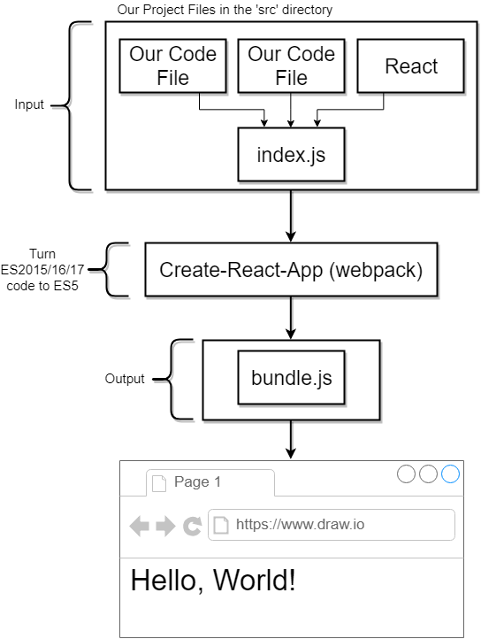


## What is React component?


## How `React` works behind the scenes

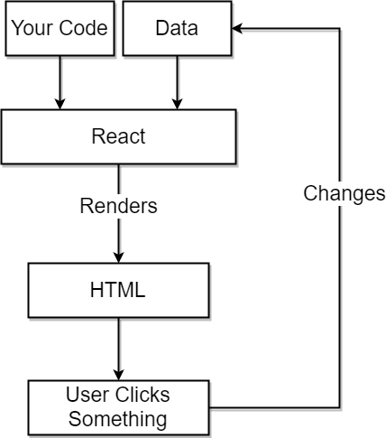


## Why single `bundle.js` matters


## JSX return HTML?

Actually, the returned "html" will be parsed using API `React.createElement()`;


## Functional Components vs Class Components?

Functional components just use in the case where you just needs to create a "mixin" as Vue do.


## Props

`React` is known as `functional programming` ; as the way `Vue` does, you can pass data from parent component to children components through properties. 

> Note that the concept of `slots` in `Vue` behaves the same as other data type  in `React` `props`; however, you should use fixed keyword `props.children` rather than the customized name.

## Hooks - Async behind the scenes

This issue comes when we need to use asynchronous apis. 


### Commonly used hooks with calling timings


## What is `state` in React?

- `State` is a JS object that contains data relevant to a component.

- Updating `state` on a component causes the component to (almost) instantly rerender
- `State` must be initialized when a component is created *(`constructor` function)*
- `State` can **only** be updated using the function `setState`


## Lifecycle Hooks

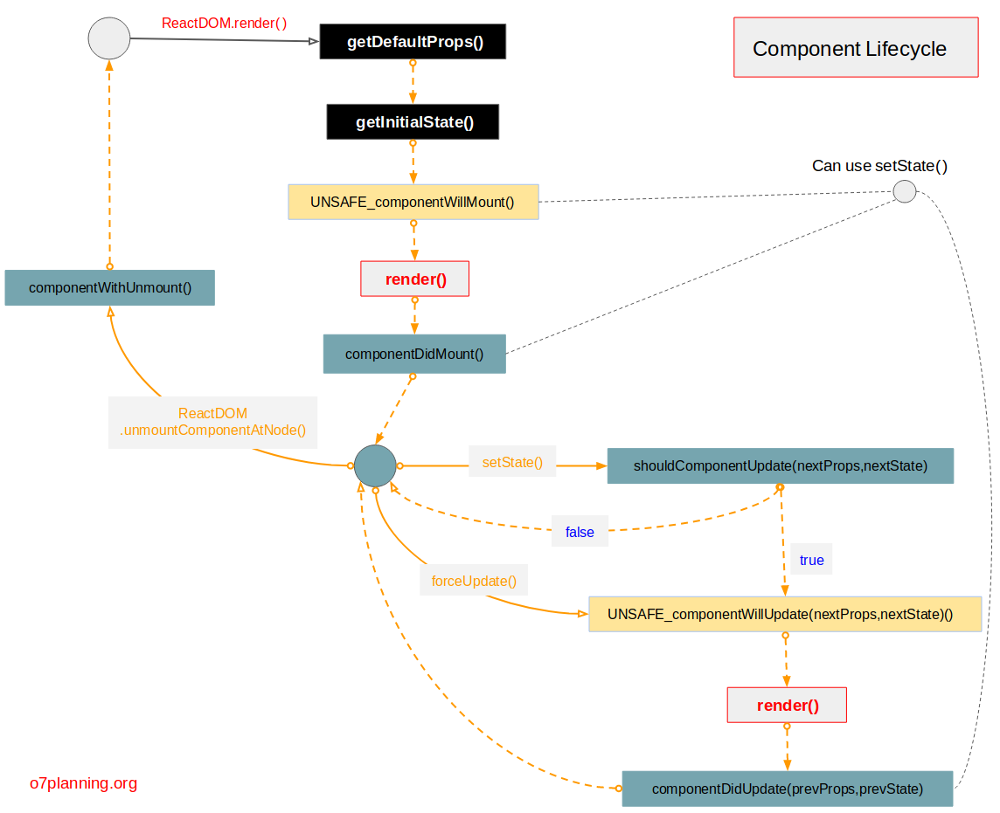


## Tips of combination of `destructuring` and `ternary`

```javascript
const seasonConfig = {
  summer: {
    text: 'Lets hit the beach!',
    iconName: 'sun'
  },
  winter:{
    text: 'Burr it is chilly',
    iconName: 'snowflake'
  }
};

const {text, iconName} = seasonConfig[season];
```

You can use built-in object literals to lookup corresponding configuration!

## default props

```javascript
Spinner.defaultProps = {
  message: 'Loading...'
};
```

## A common mistake - *this*

```javascript
  onFormSubmit (e) {
    e.preventDefault();
    console.log(this.state.term);
  }
```

when above callback is called, the global `window` will throw an error

- To fix this, you can use `bind(this)` after `this.callbackFunc = callbackFunc.bind(this)` in `constructor`.

- Or **Arrow function** 

```js
onFormSubmit = (e) => {
  e.preventDefault();
  console.log(this.state.term);
}
```

- Or `closure`

```html
<form onSubmit={(event) => onFormSubmit(event)}></form>
```


## [ Concise ] Axios - refactor your file structure

```js
import axios from 'axios';

//set default configuration for specific URL by axios
export default axios.create({
  baseURL: "https://api.unsplash.com/",
  headers: {
    Authorization: 'pswd'
  }
});

----------------------- another file using this api

import unsplash from '../api/unsplash';

onSearchSubmit = async term => {
  const response =  await unsplash.get("/search/photos", {
    params: { query: term},
  });

  this.setState( { images: response.data.results });
}
```


## `Ref` to reference a DOM

As `Vue` does, to get the latest DOM object, you can reference a element in JSX in the `constructor`.

> Note that `jsx` is not html or DOM. If you need to collaborate with other package to refence a dom, please add `ref` to the element you need to use!

```jsx
  constructor(props) {
    super(props);
    this.videoRef = React.createRef();
  }

 <video ref={this.videoRef}/>
```

# Redux

## What is `Redux`?

State management package - as `Vuex`

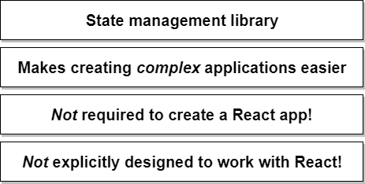

## Redux Cycle

Learn from an analogy: Insurance Company vs Cycle Terms:

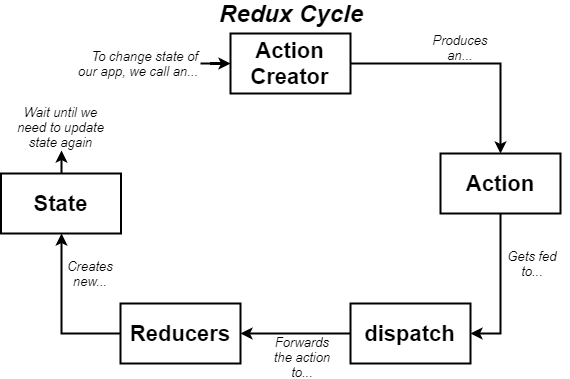


## Analogy - Insurance Company VS Redux

There are several key concepts and terms in Redux; to make myself fully understand these, let's see an analogy:

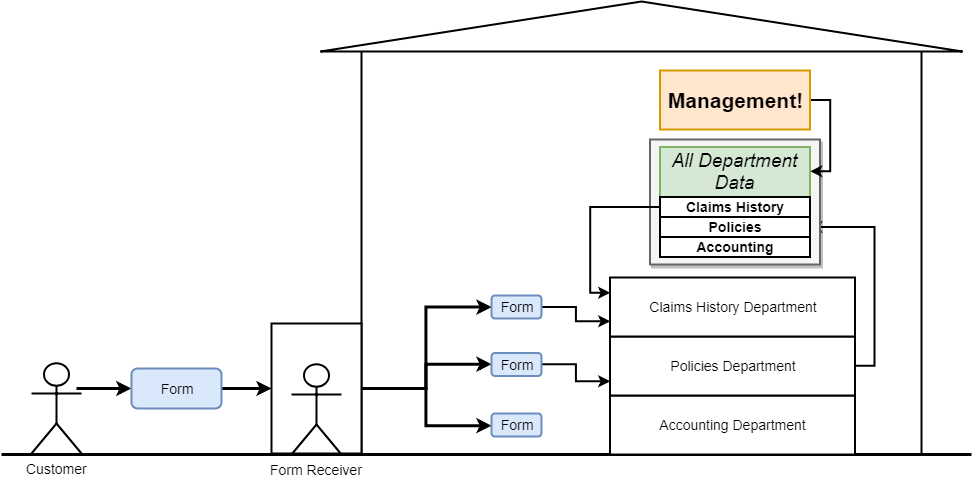

Every form consists of '*type*' and '*payload*'

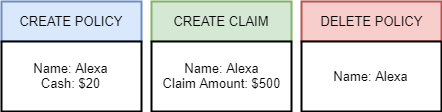


There is one of instances how the system work behind the scenes:

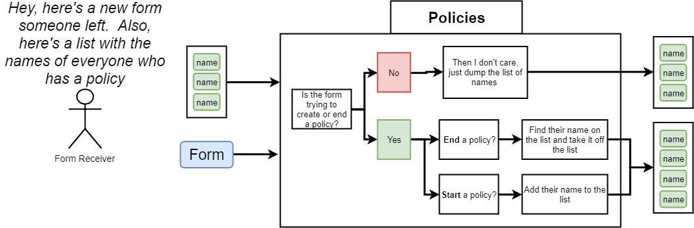

>  Note that: in terms of Reducers:
>
> *Overall goal of reducer is to take some existing data some action and then modify and return that existing data based upon the contents of an action*
>
> we prefer: `[...oldList, action.payLoad]` 
>
> than `oldList.push(action.payLoad)`
>
> that means: Never manipulate on the original object (passed by reference)!!!


>  `index.js` is the default file `webpack` would try to import if you just appoint a directory


## Combine React with Redux

>  The demo code for this topic is in the `songs` directory.

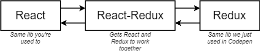


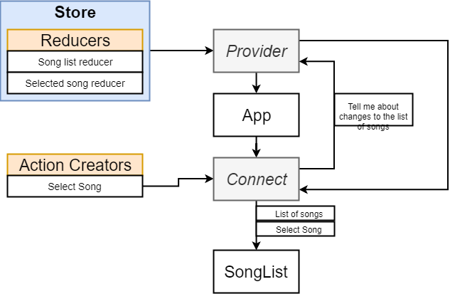

It's our responsibility to create `connect` and `Provider`; in terms of other inner stuff, Redux will do us a favor for us.

`connect` functions is passed a `mapStateToProps` function so that the component receives the data or variables stored in `store`

`connect(mapStateToProps, {..actions})(Component)`

The keys you appointed in the `Redux.combineReducers(key: arrowFunctionHandlingLogic)` will be one of keys in `mapStateToProps(state)`; `state.key1 , state.key2`


Here is a convention of directory structure:

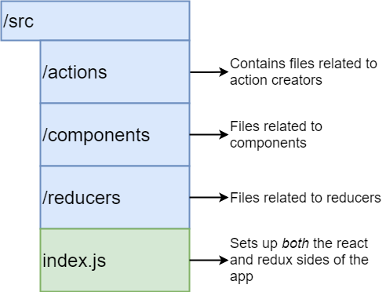


# Redux-thunk

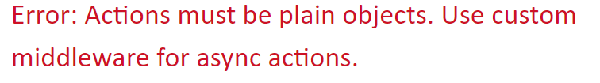

`action` must be a plain JavaSript object with `type` property while `async` request will return a `request` object

So, we need `middleware` to help us handle `async`request by relaxing condition that you can return a function in action creators.

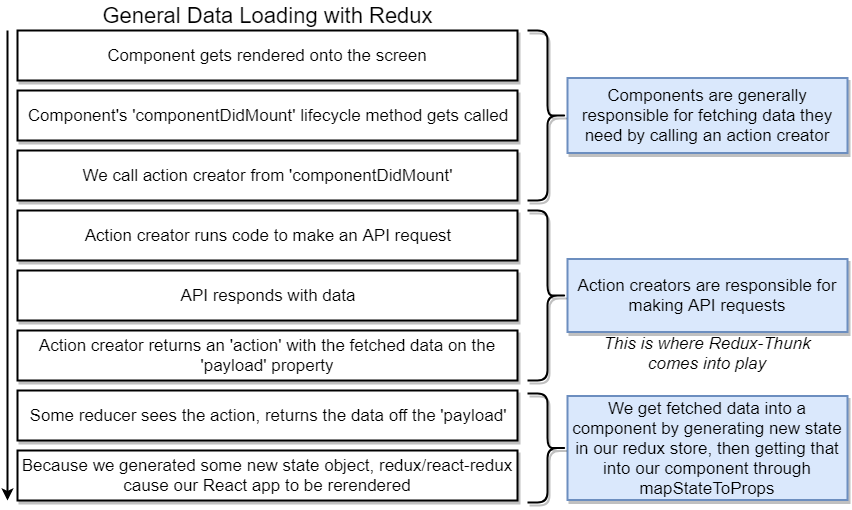


## Middleware

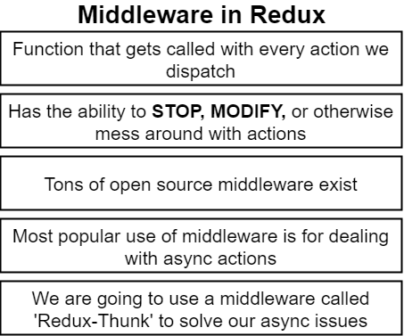


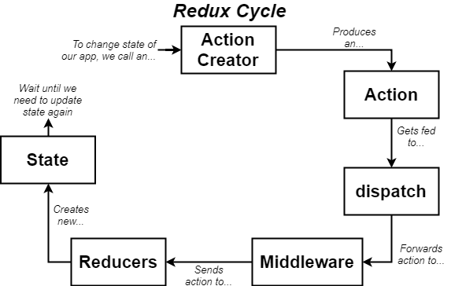

### How `thunk` works behind the scenes

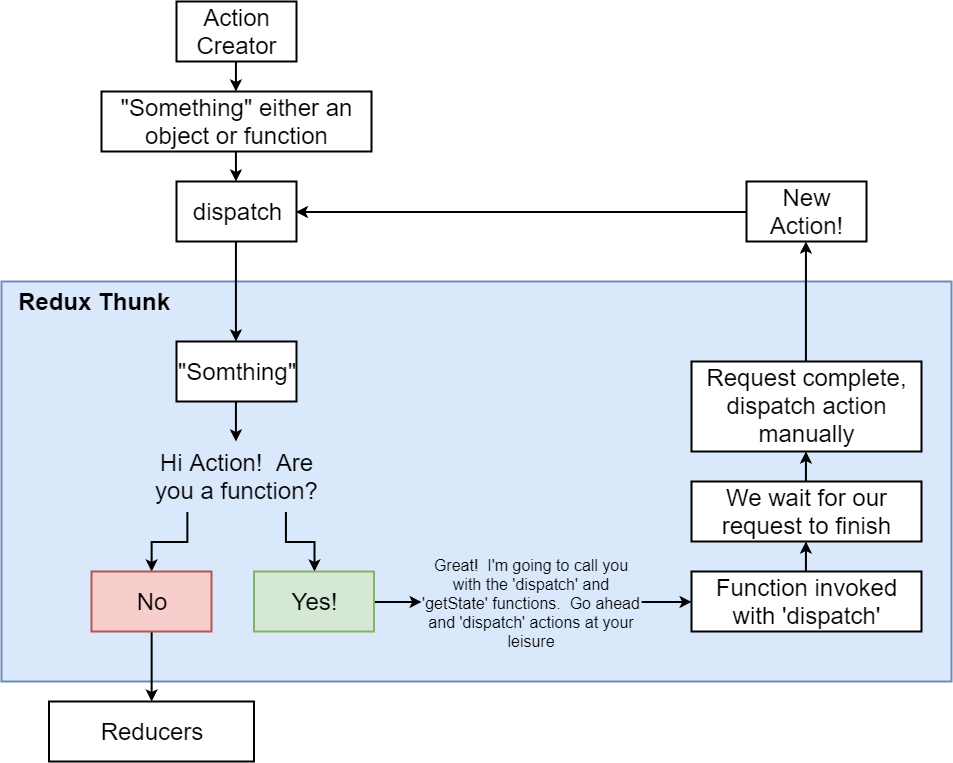

## Review: Reducers

### Rules of Reduces

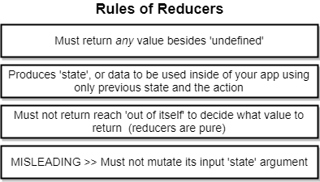

> **Misleading**: 
>
> ```javascript
> // piece of code from redux.js     
> hasChanged = hasChanged || nextStateForKey !== previousStateForKey
> ```
>
> <u>Through this line, we can tell that `redux` cannot detect mutations made in reducers. (because the same *reference*), which also explains why we also return a new array rather than orginal array.</u>


## Recommanded operation in Reducers

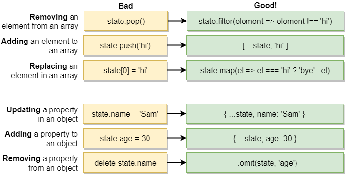

### Reducers are pure?

This means reducers' responsibility is only one thing: take last `state` and action to determine new `state`.

 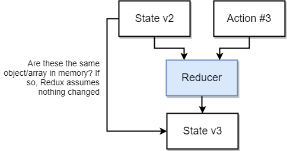


> Keep in mind: we are not going to mutate the `state` ever!

### effetive alternatives to mutate state


> It's also overkilled to pass a list of users to a component, then find only pieces of data in the list.
>
> To solve this problem, you can extract pieces of data in `mapStateToProps`.


## How to avoid overfetching ajax request?

### _.memoize (not best)

lodash provides us this high order function to cache the result of the passing in function. 

> In computing, *memoization* or memoisation is an optimization technique used primarily to speed up computer programs by storing the results of expensive function calls and returning the cached result when the same inputs occur again. 
>
> -- *from Wikipedia*

### chain the requests orderly(recommended method)

```js
export const fetchPostsAndUsers = () => async (dispatch, getState) => {
  await dispatch(fetchPosts()); 
  // the following codes will run after you fecth posts successfully
  const userIds = _.uniq(_.map(getState().posts, 'userId'));
 	// the above line gets a unique array of userIds to promise dispatch the fetchUser only once  
  userIds.forEach( id => dispatch(fetchUser(id)));
};
```

# React-Router

## How does it work?

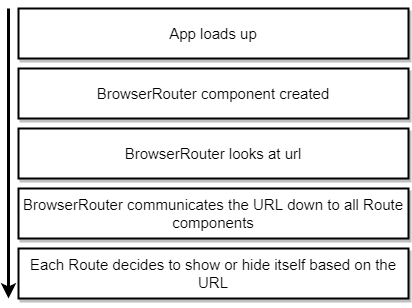


# Authentication

## What is OAuth?


## What are Scopes?

Grant our right to process or visit your emails or files stored in google drive.

## OAuth for Servers vs OAuth for JS Browser Apps


## The underlying process of login with google.

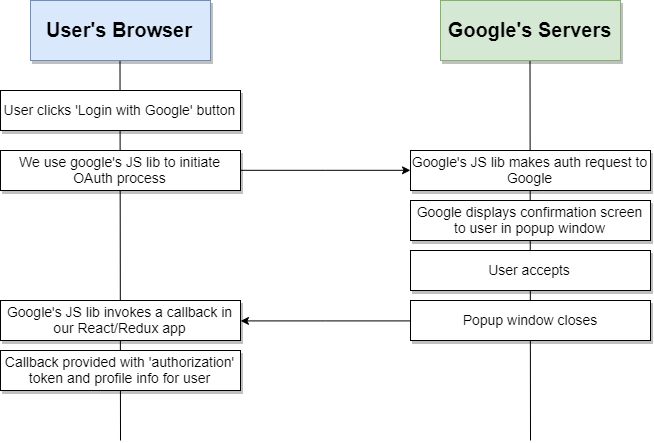

## How to use google's api in the React?

`window.gapi` offers you `api` which can manipulate in the browser.

[Document of gapi](**developers.google.com/api-client-library/javascript/reference/referencedocs**)


# Redux-Form

## What it does behind the scences?

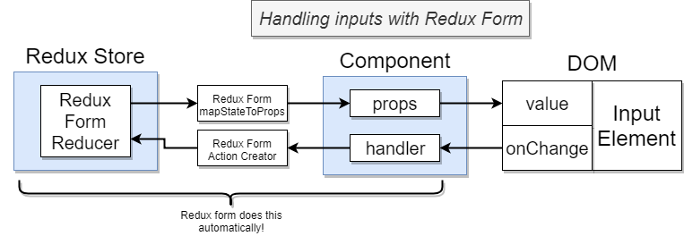


```jsx
  renderInput(formProps) {
    //this code looks magic but just es6 spread an object of formProps.input
    return <input {...formProps.input} />
  }

=============================================================================
  
 // by doing this, the form is taken over by redux-form which will prevent the default submission for us and provide us corresponding data.

      <form onSubmit={this.props.handleSubmit(this.onSubmit)} className="ui form">
        <Field name="title" component={this.renderInput} label="Enter Title"/>
        <Field name="description" component={this.renderInput} label="Enter Description"/>
        <button className="ui button primary">Submit</button>
      </form>
```


I am a little bit understanding the `single data flow` in React, that is, data only passing from parent to child through `props`. No magic in redux-form, which just acts like a syntax sugar helping you manage data with redux store. The usage is pretty similar to `redux-react`. You need to combine the form as `connect` does by `reduxForm` imported from `redux-form`. Even the syntax is identical. 


## Form Validation 

## Redux-form Validation Flow

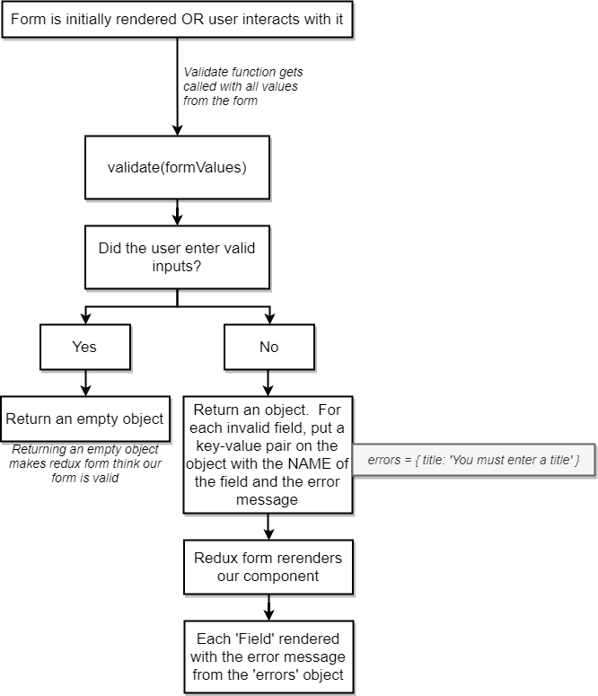

There is a pattern for form-control in all frameworks:

You need to "*inject* "the package or "*mount*" the package up to the form.

Once the validation package takes over the form, it will change the default behaviors of the form, such as extra valiadation, sanctuation checking etc.. Finally, it will return a object which either contains all validate key value pairs of data or key-value pairs error messages. 

Also, form management needs to provide us several *convention* values, such as `initialValues`, `formValues` (current you are editting) etc. To know more details, please refer the document. 

# RESTful API

## Conventions

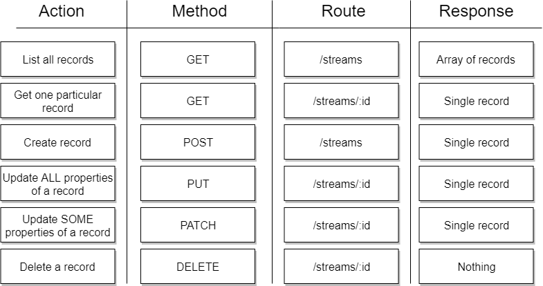

## Key Interpolation Syntax - Object-based approach

`{...state, [action.payload.id]: action.payload}`;

set `action.payload.id` as key and the value is `action.payload`

### `mapKeys` - Userful method for object-based search powerd by lodash.

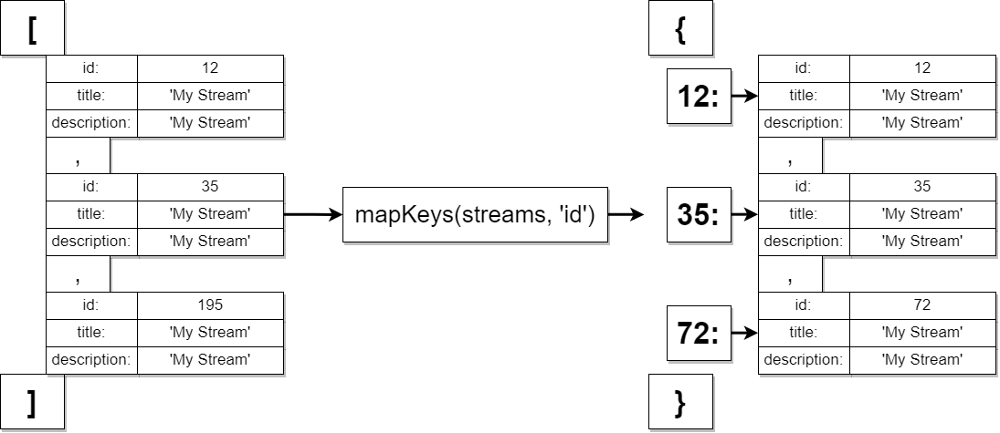


## Redirect gracefully

It is inevitable for us to sometimes redirect user to another link after a sucessful operation.

### Normal `history` working flow

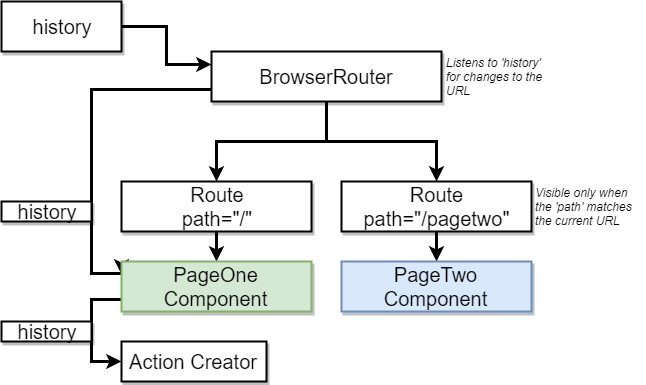

In `React`, it can be really painful if you just pass the `history` object across components. And you cannot control over the behavior of broswer `history` api. To handle the case gracefully, here provides a solution: create your own `history.js`


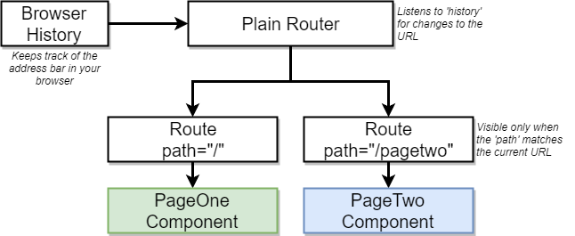

> `history` was installed automatically by `redux-router`.
>
> You can import it by `import {createBrowserHistory} from 'history';`
>
> if you wanna customize your history object, you need to update your import {`BrowserRouter`} from `redux-router` to plain `Router` (Not `Route` which is responsible for *routing*!)

> Whenever you need to get some data from `this.props`; 
>
> ```js
> const mapStateToProps = (state, ownProps) => {
>   //ownProps refers to the props of the instance provided by redux-react
>   return {stream: state.streams[ownProps.match.params.id]};
> };
> 
> ```


## Component Isolation with React Router

You can never presume that the data in the store will be dependent on another component. That is, you need to check whether the data exists in the store, then handle it.

## Why we use `portal`?


As I mentioned before, `React` is totally **<u>one direction flow</u>**. It is the normal case that a component is deeply attached to the root component, which is definitely a disastar for css styling. You are prone to be trapped by weird css style, no matter how skillful you are on CSS. To solve this issue, we can mount the component directly on `<body>`. In this way, we can overlap the root component much easier.   

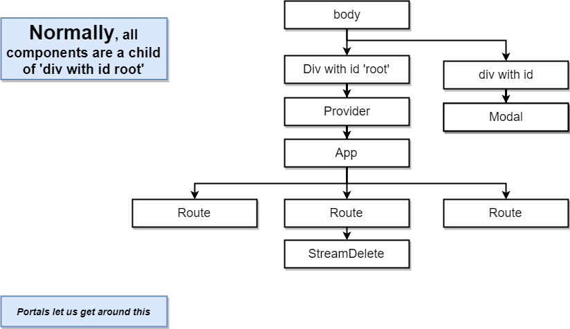


## Why we need React.Fragment?

In JSX, we are supposed to return all contents wrapped by a single wrapper. Sometimes we just want to return multiple tags. To solve this, `React.Fragment` comes, which will not be rendered as any tag in the parsed htlm from jsx.


## `Switch` from redux-route-dom

```jsx
<Router history={history}>
  <div>
    <Header />
    <Switch>
      <Route path="/" exact component={StreamList} />
      <Route path="/streams/new" exact component={StreamCreate} />
      <Route path="/streams/edit/:id" exact component={StreamEdit} />
      <Route path="/streams/delete/:id" exact component={StreamDelete} />
      <Route path="/streams/:id" exact component={StreamShow} />
    </Switch>
  </div>
</Router>
```

In `React`, the path matching process is done by comparing all routes and returns all matching ones. That is the reason why we use `exact` attribute in the <Route>. However, please focus on the route `/streams/new` and `/streams/:id`, they are sharing the same pattern to React. That is, `:id`  just indicates a variable which can be named as a string - "new".  To resolve the route correctly, we introduced `Switch` from `react-route-dom` that will only return one matching result.

> Note that if you notice there are some extra HTML in your component, it might be the result of path matching.


# Context System in React

## What is it ?

[A great thread illustrating Context and Redux](https://blog.bitsrc.io/react-context-api-a-replacement-for-redux-6e20790492b3)

