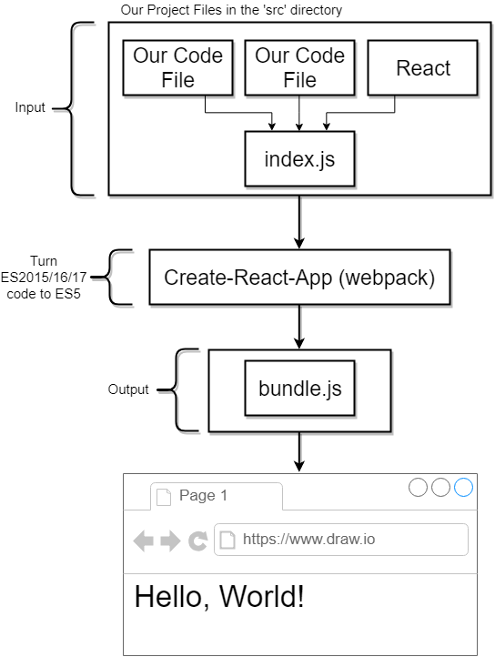
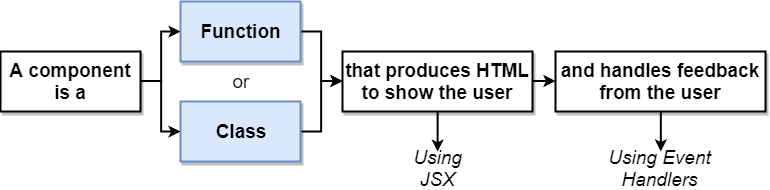
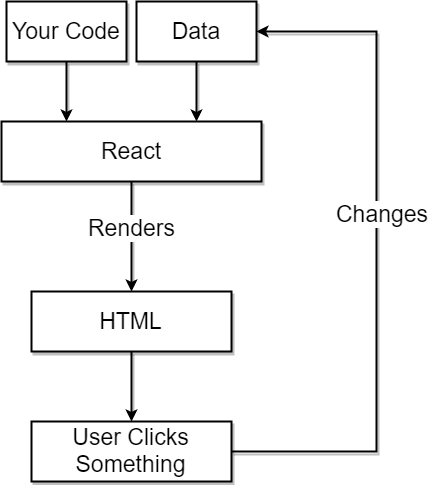
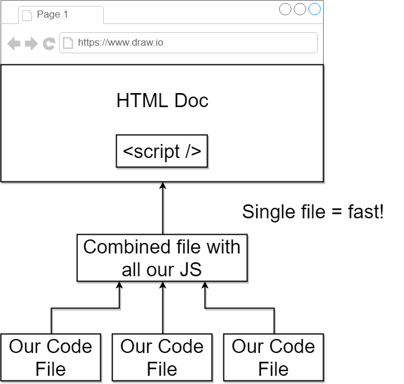
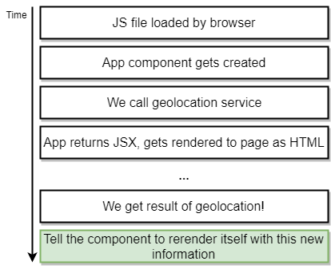

# Notes of React 

## JSX

It looks like HTML and can be placed in JS code. Determines the content of our React app just like normal HTML.

##  React vs ReactDOM

React is split into two separate libraries.

`React` knows what a component is and how to make components work together

`ReactDOM` knows how to take a component and make it show up in the DOM.

`create-react-app` is the scaffold in React

## What `webpack` does?

## What is React component?

## How `React` works behind the scenes

## Why single `bundle.js` matters

## JSX return HTML?

Actually, the returned "html" will be parsed using API `React.createElement()`;

## Functional Components vs Class Components?

Functional components just use in the case where you just needs to create a "mixin" as Vue do.

## Props

`React` is known as `functional programming` ; as the way `Vue` does, you can pass data from parent component to children components through properties. 

> Note that the concept of `slots` in `Vue` behaves the same as other data type  in `React` `props`; however, you should use fixed keyword `props.children` rather than the customized name.

## Hooks - Async behind the scenes

This issue comes when we need to use asynchronous apis. 

## What is `state` in React?

- `State` is a JS object that contains data relevant to a component.

- Updating `state` on a component causes the component to (almost) instantly rerender
- `State` must be initialized when a component is created
- `State` can **only** be updated using the function `setState`

