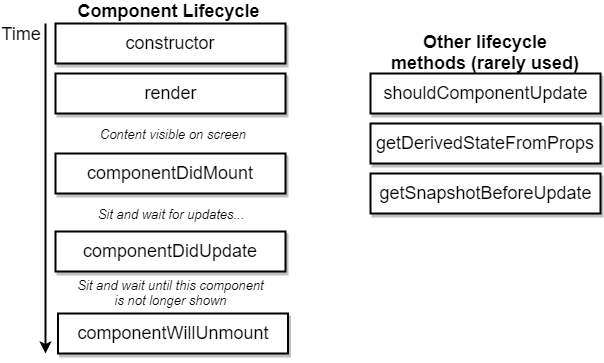

[TOC]


# React

## JSX

It looks like HTML and can be placed in JS code. Determines the content of our React app just like normal HTML.

##  React vs ReactDOM

React is split into two separate libraries.

`React` knows what a component is and how to make components work together

`ReactDOM` knows how to take a component and make it show up in the DOM.


`create-react-app` is the scaffold in React


## What `webpack` does?


## What is React component?


## How `React` works behind the scenes


## Why single `bundle.js` matters


## JSX return HTML?

Actually, the returned "html" will be parsed using API `React.createElement()`;


## Functional Components vs Class Components?

Functional components just use in the case where you just needs to create a "mixin" as Vue do.


## Props

`React` is known as `functional programming` ; as the way `Vue` does, you can pass data from parent component to children components through properties. 

> Note that the concept of `slots` in `Vue` behaves the same as other data type  in `React` `props`; however, you should use fixed keyword `props.children` rather than the customized name.

## Hooks - Async behind the scenes

This issue comes when we need to use asynchronous apis. 


### Commonly used hooks with calling timings



## What is `state` in React?

- `State` is a JS object that contains data relevant to a component.

- Updating `state` on a component causes the component to (almost) instantly rerender
- `State` must be initialized when a component is created *(`constructor` function)*
- `State` can **only** be updated using the function `setState`


## Lifecycle Hooks


## Tips of combination of `destructuring` and `ternary`

```javascript
const seasonConfig = {
  summer: {
    text: 'Lets hit the beach!',
    iconName: 'sun'
  },
  winter:{
    text: 'Burr it is chilly',
    iconName: 'snowflake'
  }
};

const {text, iconName} = seasonConfig[season];
```

You can use built-in object literals to lookup corresponding configuration!

## default props

```javascript
Spinner.defaultProps = {
  message: 'Loading...'
};
```

## A common mistake - *this*

```javascript
  onFormSubmit (e) {
    e.preventDefault();
    console.log(this.state.term);
  }
```

when above callback is called, the global `window` will throw an error

- To fix this, you can use `bind(this)` after `this.callbackFunc = callbackFunc.bind(this)` in `constructor`.

- Or **Arrow function** 

```js
onFormSubmit = (e) => {
  e.preventDefault();
  console.log(this.state.term);
}
```

- Or `closure`

```html
<form onSubmit={(event) => onFormSubmit(event)}></form>
```


## [ Concise ] Axios - refactor your file structure

```js
import axios from 'axios';

//set default configuration for specific URL by axios
export default axios.create({
  baseURL: "https://api.unsplash.com/",
  headers: {
    Authorization: 'pswd'
  }
});

----------------------- another file using this api

import unsplash from '../api/unsplash';

onSearchSubmit = async term => {
  const response =  await unsplash.get("/search/photos", {
    params: { query: term},
  });

  this.setState( { images: response.data.results });
}
```


## `Ref` to reference a DOM

As `Vue` does, to get the latest DOM object, you can reference a element in JSX in the `constructor` 

# Redux

## What is `Redux`?

State management package - as `Vuex`


## Redux Cycle

Learn from an analogy: Insurance Company vs Cycle Terms:


## Analogy - Insurance Company VS Redux

There are several key concepts and terms in Redux; to make myself fully understand these, let's see an analogy:


Every form consists of '*type*' and '*payload*'


There is one of instances how the system work behind the scenes:


>  Note that: in terms of Reducers:
>
> *Overall goal of reducer is to take some existing data some action and then modify and return that existing data based upon the contents of an action*
>
> we prefer: `[...oldList, action.payLoad]` 
>
> than `oldList.push(action.payLoad)`
>
> that means: Never manipulate on the original object (passed by reference)!!!


>  `index.js` is the default file `webpack` would try to import if you just appoint a directory


## Combine React with Redux

>  The demo code for this topic is in the `songs` directory.


It's our responsibility to create `connect` and `Provider`; in terms of other inner stuff, Redux will do us a favor for us.

`connect` functions is passed a `mapStateToProps` function so that the component receives the data or variables stored in `store`

`connect(mapStateToProps, {..actions})(Component)`

The keys you appointed in the `Redux.combineReducers(key: arrowFunctionHandlingLogic)` will be one of keys in `mapStateToProps(state)`; `state.key1 , state.key2`


Here is a convention of directory structure:


# Redux-thunk


`action` must be a plain JavaSript object with `type` property while `async` request will return a `request` object

So, we need `middleware` to help us handle `async`request by relaxing condition that you can return a function in action creators.


## Middleware


### How `thunk` works behind the scenes


## Review: Reducers

### Rules of Reduces


> **Misleading**: 
>
> ```javascript
> // piece of code from redux.js     
> hasChanged = hasChanged || nextStateForKey !== previousStateForKey
> ```
>
> <u>Through this line, we can tell that `redux` cannot detect mutations made in reducers. (because the same *reference*), which also explains why we also return a new array rather than orginal array.</u>

### Reducers are pure?

This means reducers' responsibility is only one thing: take last `state` and action to determine new `state`.

 


> Keep in mind: we are not going to mutate the `state` ever!

### effetive alternatives to mutate state

